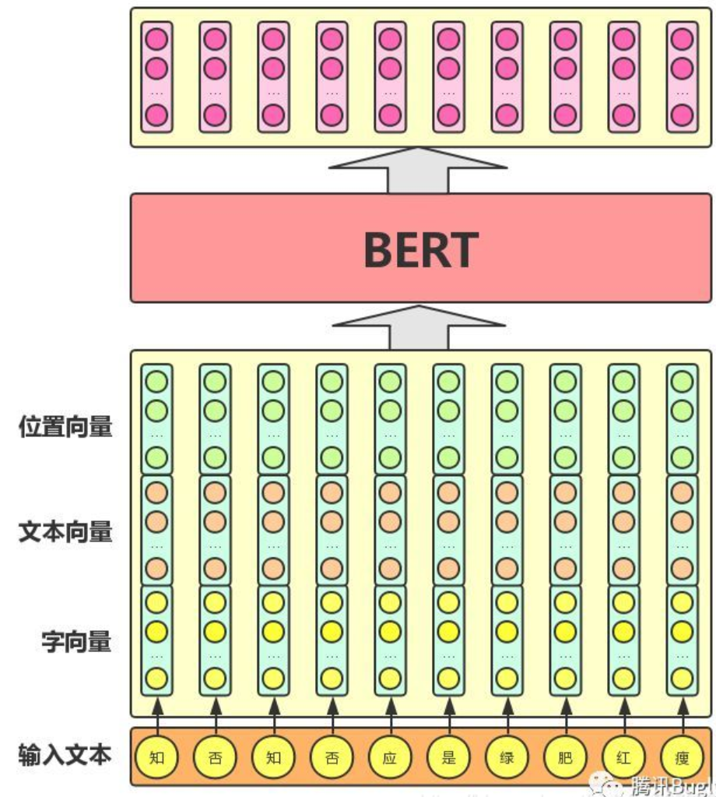
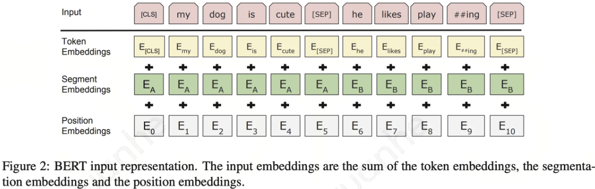
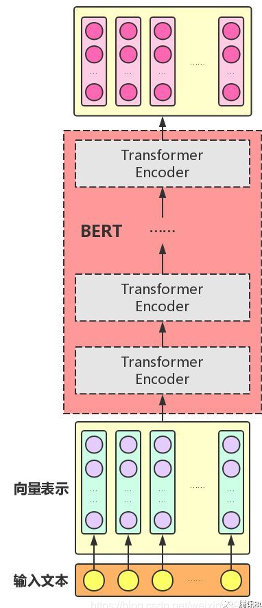
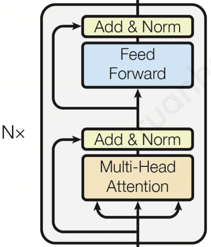

# BERT

## 简介

BERT（Bidirectional Encoder Representations from Transformers）是一个基于 Transformer 的 LLM。BERT 是一种典型的二阶段范式，先使用大量未标记的文本进行预训练，然后使用标记的数据进行微调。

### 原理

#### 双向编码

在文本序列被预处理后，输出可以被认为是一个矩阵，其中每一行都是一个表示预定义词表中词的向量。由于语言模型的自回归特性，GPT 只能向前看（从左到右）。在“i went to the bank to deposit cash”（我去银行存现金）和“i went to the bank to sit down”（我去河岸边坐下）的上下文中，由于“bank”对其左边的上下文敏感，GPT 将返回“bank”的相同表示，尽管它有不同的含义。BERT 对上下文进行双向编码，并且对于大多数的 NLP 任务只需要最少的架构改变。通过使用预训练的 Transformer encoder，BERT 能够基于其双向上下文表示任何词元。

## 网络结构/encoder

BERT 采用了原始 Transformer 的 encoder。由于没有 MMHA，因此在建模时允许每个 token 访问其前后两个方向的 context，因此 BERT 是双向的。标准语言模型是单向的，这限制了在预训练期间可以使用的结构选择。例如，在 OpenAI GPT 中，作者使用从左到右的架构，其中在 Self-attention 中每个 token 只能访问先前的 token。这种限制对于句子级任务来说是次优的，并且在将基于微调的方法应用于 token-level 任务（如问题回答）时可能非常有害，因为在这些任务中，从两个方向结合上下文是至关重要的。

BERT 包含多个 block，每个 block 中包含两个子层：MHA  层和 FF（Feed-Forward）层。

### 输入层

BERT 模型的输入层是由 3 个部分组成：Embedding 词向量、位置向量和段向量。

- Embedding 词向量：是每个单词的向量表示。
- 位置向量：是指定每个单词在句子中的位置。
- 段向量：用于区分不同句子之间的关系。

这些向量经过拼接得到一个包含所有信息的向量，作为 Transformer 的输入。

### block

后续会把多个 encoder 的 block 一层一层地堆叠起来。

#### MHA

BERT 中的 MHA 层与 Transformer 中的相似，它的核心思想是将输入数据同时传入多个不同的 Self-attention 模块，并将所有模块的输出结果合并。这允许模型同时捕捉输入数据的多种不同表示。它允许模型在处理序列时，将序列中的每个词元与其他词元进行交互（Self-attention），并根据这些交互来计算每个词元的权重。这些权重用于加权求和序列中的每个词元，生成最终的输出。与传统的 Self-attention 不同，BERT 中的 Self-attention 是双向的，即可以看到当前位置之前和之后的所有信息。

#### FF

在完成 Self-attention 层之后，BERT 中的每个 block 还包含一个 FF（Feed-Forward），用于对特征进行线性变换和非线性变换，以便更好地进行下一层的建模。

#### Add&Norm

BERT 中的每个 block 都包含 Add&Norm。残差连接可以帮助信息流更加顺畅地通过网络，避免信息丢失。层归一化则是一种正则化技术，可以使得模型对输入更加鲁棒，并加速训练收敛。

### 输出层

BERT 模型的输出通常是一个固定长度的向量，表示整个句子的语义信息。在 BERT 中，这个向量是由最后一个 block 的所有隐藏层向量的加权和得到的。这个输出向量可以用于下游任务的微调，例如情感分析、命名实体识别等。

## 训练方法

与初代 GPT 相同，BERT 也分为无监督 Pre-training 和有监督 Fine-tuning 2 个阶段。

### 无监督Pre-training

与 GPT 和其它预训练语言模型从左到右或是从右到左的标准预训练方式不同，BERT 提出了 2 个新的预训练任务：

#### MASK LM

BERT 使用了 Masked LM（Language Model）训练方式，其中模型在输入序列中随机地掩盖一些单词，并要求模型预测这些被掩盖的单词，这个训练任务有助于模型更好地理解语言中的上下文信息。这种 masked 的训练技巧可以理解为在做一种语言填空练习，就像我们在学校里做英语完型填空题一样。在这种练习中，BERT 会随机选择一些文本中的词汇并进行屏蔽，就像把填空题的空格用一条横线代替一样。然后，BERT 需要根据上下文和语法规则来猜测被屏蔽的词汇，就像根据句子的意义和语法规则来猜测填空题的答案一样。经过不断的反复练习，BERT 就变成了一个无情的做题狂魔。这样 BERT 就能更好地理解和表示文本的含义。此外，由于在屏蔽词汇时需要随机选择，这也可以帮助 BERT 更好地应对文本中出现的不同词汇和语言变化，增强其泛化能力。

在这个预训练任务中，要预测一个掩蔽词元而不使用标签作弊，一个简单的方法是总是用一个特殊的“&lt;mask&gt;”替换输入序列中的词元。然而，人造特殊词元“&lt;mask&gt;”不会出现在微调中。为了避免预训练和微调之间的这种不匹配，如果为预测而屏蔽词元（例如，在“this movie is great”中选择掩蔽和预测“great”），则在输入中将其替换为：

* 80%时间为特殊的“&lt;mask&gt;“词元（例如，“this movie is great”变为“this movie is&lt;mask&gt;”；
* 10%时间为随机词元（例如，“this movie is great”变为“this movie is drink”）；
* 10%时间内为不变的标签词元（例如，“this movie is great”变为“this movie is great”）。

请注意，在15%的时间中，有10%的时间插入了随机词元。这种偶然的噪声鼓励 BERT 在其双向上下文编码中不那么偏向于掩蔽词元（尤其是当标签词元保持不变时）。

#### Next Sentence Prediction

尽管掩蔽语言建模能够编码双向上下文来表示单词，但它不能显式地建模文本对之间的逻辑关系。为了帮助理解两个句子之间的关系，BERT 在预训练中考虑了 NSP（Next  Sentence   Prediction）。 NSP 指给定一篇文章中的两句话，判断第二句话在文本中是否紧跟在第一句话之后。我们要求模型除了做上述的 Masked 语言模型任务外，附带再做个句子关系预测，判断第二个句子是不是真的是第一个句子的后续句子。之所以这么做，是考虑到很多 NLP 任务是句子关系判断任务，单词预测粒度的训练到不了句子关系这个层级，增加这个任务有助于下游句子关系判断任务。

NSP 指做语言模型预训练的时候，分两种情况选择两个句子，一种是选择语料中真正顺序相连的两个句子（50%）；另外一种是第二个句子从语料库中随机选择一个拼到第一个句子后面（50%）。

### 有监督Fine-tuning

BERT 中的 Fine-tuning 是一种有监督的训练方式，它可以在特定任务上微调之前预训练的 BERT 模型，使得模型能够更好地适应特定任务。Fine-tuning 通常包括以下几个步骤：

- 准备数据：Fine-tuning 的第一步是准备特定任务的数据集。在准备数据集时，需要将原始数据转化为符合 BERT 输入格式的形式，即每个输入样本应该包含一个固定长度的输入向量和一个对应的标签。数据集的大小和质量对于 Fine-tuning 的性能有重要影响。
- 加载预训练模型：Fine-tuning 的第二步是加载预训练的 BERT 模型，并在该模型的基础上进行微调。BERT 模型通常是在大规模的无监督数据上进行预训练，因此它已经学会了单词的语义表示和上下文信息。
- 微调模型：Fine-tuning 的第三步是微调预训练模型，以适应特定任务。在微调过程中，通常需要对模型的最后一层或几层进行修改，以便输出与任务相关的标签。微调的过程可以使用基于梯度的优化算法，如 Adam 等。在微调过程中，需要进行超参数的调整和模型的评估，以获得最好的性能。
- 评估模型：Fine-tuning 的最后一步是对微调后的模型进行评估。通常使用一些评估指标来评估模型的性能，例如准确率、召回率等。在评估过程中，需要使用独立于微调数据集的测试数据集进行评估，以获得模型在新数据上的性能。

Fine-tuning 是 BERT 模型在实际任务中应用的核心部分，它可以为各种 NLP 任务提供强大的性能提升。

## 推理流程

## Ref

1. [BERT模型理论详解](https://blog.csdn.net/weixin_39798910/article/details/110073695)
2. [ChatGPT的前世今生——原理解析和拓展思考](https://km.woa.com/group/52143/articles/show/533771)
3. [万字长文教你如何做出ChatGPT](https://km.woa.com/group/51993/articles/show/535450)

