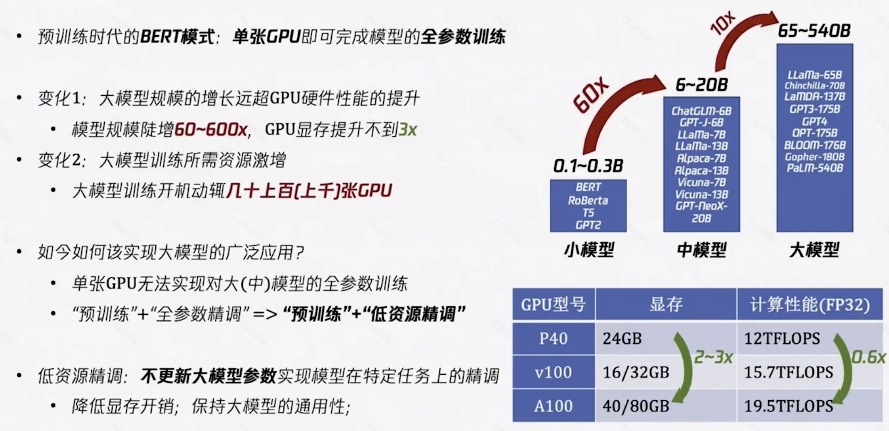
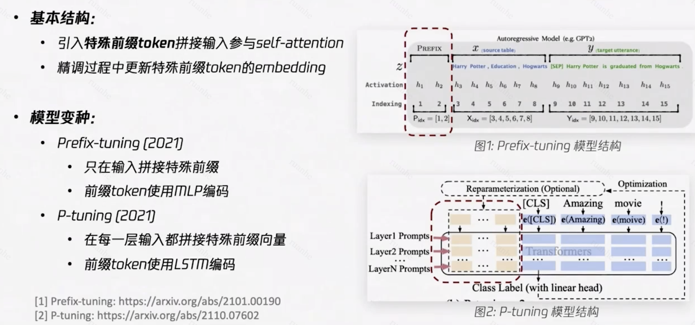
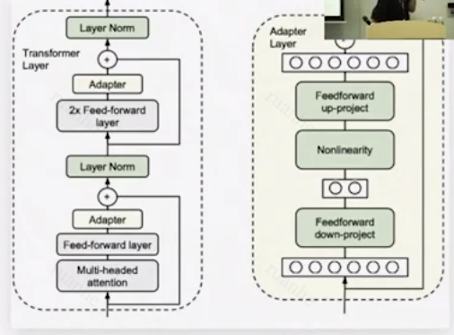
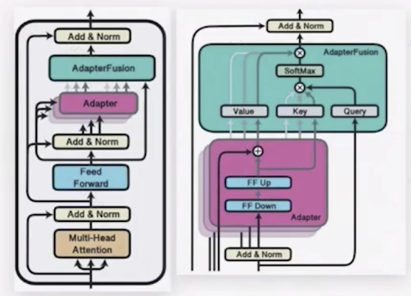
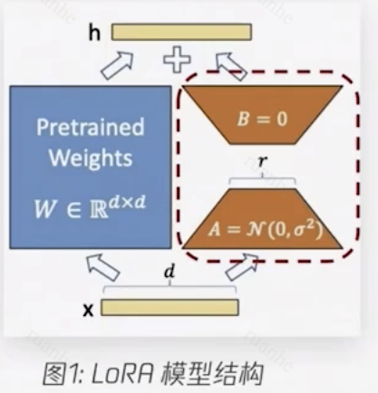
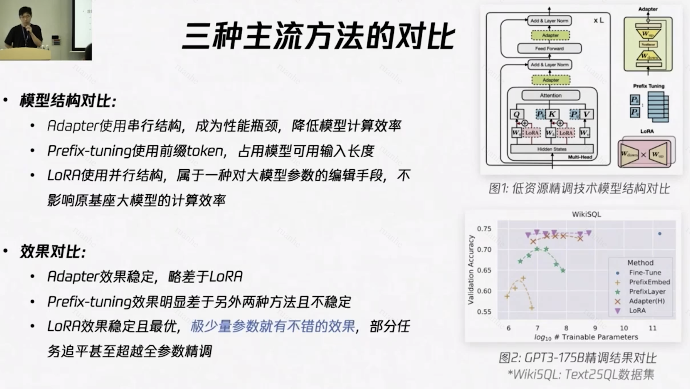

# PEFT

## 简介

低资源微调 PEFT（Parameter-Efficient Fine-Tuning）就是在不更新大模型参数的前提下实现大模型在特定任务上的微调和数据拟合。这种 PEFT 的做法有 2 大优势：

- 降低模型训练的显存开销：在模型训练过程中，很大一部分的显存开销来自于记录参数梯度和优化器状态，现在不需要更新大模型参数就大大降低了这部分的显存占用；
- 保持了大模型的通用性：不会因为拟合某一个任务的数据而改变大模型的原始参数，这样一个基座模型就可以同时支持多个下游任务。

当前主流的 PEFT 方法大致可以分成 4 类：**Prompt-tuning**、**Prefix-tuning**、**Adapter**、**LoRA**，这 4 类方法都采用了引入“插件参数”来微调微调 LLM 的做法。由于目前 LLM 的结构基本都是 Transformer，这些方法的主要区别就在于：1）“插件参数”在 Transformer 中如何放置以及如何参与计算；2）“插件参数”的模型结构。



### vs. Prompt工程/Full Fine-tuning

Prompt 工程是最轻量化的使用方式，不同业务直接针对同一个 LLM 撰写不同的 Prompt 就可以实现业务目标。它的不足是对基座 LLM 有较高的要求，LLM 足够强大时才更容易获得想要的结果。针对具体任务的效果，比起另外几种方法可能差一些。Prompt 工程也分为两种：

- Zero-shot Prompt：需要 0 训练样本、对模型直接提问。
- Few-shot/In-context Learning：是可能被低估的一类很有效的用法，一般使用几个训练样本示例让 LLM 对齐任务的意图与格式。

Full Fine-tuning 的优势是对具体任务场景往往可以达到最好的效果。FFT 的原理就是用特定的数据对 LLM 进行训练，将 W 变成 W‘，W’ 相比 W 最大的优点就是上述特定数据领域的表现会好很多。 但 FFT 也会带来一些问题，影响比较大的问题，主要有以下两个：

- 一个是训练的成本会比较高，因为微调的全量参数量，所以更新了模型全部参数，导致必须要独立部署、使用成本高，训练也会更加耗费资源。
- 一个是叫灾难性遗忘（Catastrophic Forgetting），用特定训练数据去微调可能会把这个领域的表现变好，但也可能会把原来表现好的别的领域的能力变差。

PEFT 是二者之间的折衷方案，它的优势是不需要很多资源就可以让 LLM 的能力贴合具体业务的训练数据，理论上支持多个业务基于同一个基座联合部署。不足是往往仍需要一定量的训练数据（业务中一般使用千级以上样本）。

## Prompt Tuning

说起大模型的 PEFT，其最早的雏形是 2019 年 GPT-2 提出的 Prompt Learning 和 2020 年 GPT-3 提出的 In-context Learning。两者都是在不改变大模型参数的前提下，通过改变输入来实现新任务的迁移，前者是通过 Prompt 给定任务和问题的描述，后者在任务描述的基础上还会增加几个样例，两种方法都是引导模型理解新的任务模式从而完成新任务上的预测。

Prompt tuning 是一种更近期的 PEFT 的方法，重点是调整输入的 prompt 而非修改模型参数。这意味着预训练模型保持不变，只有输入 prompt 被修改以适应下游的任务。通过设计和优化一组 prompt，可以使预训练模型执行特定任务。

### 原理

Prompt tuning 是 Prompt 在输入给 LLM 之后，在开始进行 Transformer 的 encoder 处理之前进行优化，Prompt Tuning 主要发生在 Embedding 这个环节的。

其基本原理是在输入序列 X 之前，增加一些特定长度的特殊 Token，以增大生成期望序列的概率。如果将大模型比做一个函数：Y=f(X)，那么 Prompt Tuning 就是在保证函数本身不变的前提下，在 X 前面加上了一些特定的内容，而这些内容可以影响 X 生成期望中 Y 的概率。

## Prefix Tuning

基于 Prompt 工程的实践表明，在不改变 LLM 的前提下，在 Prompt 上下文中添加适当的条件，可以引导 LLM 有更加出色的表现。Prefix-tuing 是 Prompt 工程的升级版。具体来说就是引入一些特殊前缀 token，将这些前缀 token 和原有输入拼接后一起输入模型参与计算，然后在 Fine-tuning 过程中可以更新这些特殊前缀 token 的 Embedding，这些特殊前缀 token 的 Embedding 就是“插件参数”。

Prompt Tuning 在 Embedding 环节，往输入序列 X 前面加特定的 Token。而 Prefix Tuning 是在 Transformer 的 encoder 和 decoder 的网络中都加了一些特定的前缀。具体来说，就是将 Y=WX 中的 W，变成 W` = [Wp; W]，Y=W`X。

Prefix Tuning 也保证了基座模型本身是没有变的，只是在推理的过程中，按需要在W前面拼接一些参数。


### Prefix-tuning

目前比较有代表性的 Prefix-tuning 方法有 Prefix-tuning 和 P-tuning 两种。Prefix-tuning 只在输入层拼接特殊前缀 token，而 P-tuning 除了在输入层还在每一个中间层的输入上都拼接特殊的前缀向量。




### P-tuning


## Adapter

Adapter 的设计思路是在 Transformer 层之间串行插入一个低秩的 FF 网络模块。这个低秩 FF 模块就是 Adapter，其结构包含一层降维 FF、一层非线性变换、一层升维 FF，并且降维之后的维度被压缩得非常小，使得引入的“插件参数”量也非常少。

### AdapterH

目前 Adapter 思想已经衍生出多种结构，其中 AdapterH 采用的是在 MHA 层和 FF 层之后各插入一个 Adapter；而 AdapterP 采用的是在 Add&Norm 层之后插入一个 Adapter，并且重新设计了 Adapter 结构加入了一个 Adapter Fusion 模块。




### AdapterP

在Add&Norm后插入Adapter



## LoRA

在 Transformer 线性层并行插入“旁路”模块，输出结果加和，同时旁路采用低秩结构。

LoRA（Low-Rank Adaptation of Large Language Models）参考了迁移学习，在有一个已经训练好的 LLM 之后，再训练一个依赖于大模型的小模型，组合在一起工作，达到用较低的成本实现对 LLM 的精调。

LoRA 背后有一个假设：我们现在看到的这些大语言模型，它们都是被过度参数化的。而过度参数化的大模型背后，都有一个低维的本质模型。通俗讲人话：大模型参数很多，但并不是所有的参数都是发挥同样作用的；大模型中有其中一部分参数，是非常重要的，是影响大模型生成结果的关键参数，这部分关键参数就是上面提到的低维的本质模型。



### 原理

具体来说，对于 Transformer 的任意线性层都可以并行插入一个“旁路”模块，线性层的输入同时经过原始权重和“旁路”模块权重变换后将得到的结果加和再输出。这个“旁路”模块就是“插件参数”，其采用的是一个低秩矩阵结构，即通过矩阵分解将原始的 d x d 维矩阵 W 用一个 d x r 维矩阵 A 和一个 r x d 维矩阵 B 的乘积来表示，并且 r <<  d，保证了引入的“插件参数”量非常少。

- 首先, 要适配特定的下游任务，要训练一个特定的模型，将Y=WX变成Y=(W+∆W)X，这里面∆W主是我们要微调得到的结果；
- 其次，将∆W进行低维分解∆W=AB (∆W为m * n维，A为m * r维，B为r * n维，r就是上述假设中的低维)；
- 接下来，用特定的训练数据，训练出A和B即可得到∆W，在推理的过程中直接将∆W加到W上去，再没有额外的成本。
- 另外，如果要用LoRA适配不同的场景，切换也非常方便，做简单的矩阵加法即可：(W + ∆W) - ∆W + ∆W`。

Low Rank Adaptation 是指用秩较低的矩阵替代之前秩较高的矩阵，假设有如下 3x4 的矩阵：

```css
[1，2，3，4]
[2，4，6，8]
[3，6，8，12]
```

要存储它，需要用到 12 个数字。但该矩阵有一个特点，第二行可以由 [1，2，3，4] 乘以2得到，第三行可以由 [1，2，3，4] 乘以3得到。那么就可以用 [1，2，3，4]  4个数字，加上 1、2、3 这三个系数，总共 7 个数字表示该矩阵。需要的数字量从 12 个降低到了 7 个。设原始矩阵为 W，分解之后数字量更少的两个矩阵 B 和 A，公式记为W=BA，数学上有办法进行精度有损的矩阵秩分解。

假设我们的模型深度为 L（Layer的首字母），每一层的参数为矩阵 W。并且，假设之前已经训练好了一个模型，这个模型的参数冻结住永远不变，记为 W0。那么被持续训练的模型就是在不断改变下面这个公式的 ΔW 模型参数变更的增量。


这个增量可以通过低秩分解，分解为：


训练的主要过程和所有 fine-tuning 一样，只是多了一个细节：把训练后的参数变更保存到了 BA 中，而不是直接更新到 W0 里。

这里，稍微讲解一下训练一个Transformer模型需要的显存量。训练每2个字节大小个16位浮点数表示的参数，需要20个字节的显存。那么，常见的70亿参数的模型，大小是14GBytes，需要的显存至少是140GBytes，如果要提高并行度，就需要更多显存。当前比较强的[A100显卡](https://www.nvidia.com/en-us/data-center/a100/)，单卡有40G显存和80G显存两个版本，单卡无法进行训练，必须要多卡同时进行。显存容量，决定了模型能不能开始训练，GPU算力决定了要训练多久。

至此，我们可以得到以下几个结论：

- 模型训练好之后做线上推理服务，计算量并没有减少，反而有所增加；
- 低秩矩阵的大小是可以调整的，可以非常小。低秩矩阵越小，损耗精度越多；
- 训练过程，计算量比用同样的训练数据进行fine-tuning没减少，反而还增加了。但是，训练所需要的显存的使用量减少1/3到2/3（不展开具体如何计算的）。这是训练成本下降的地方；
- 微调后的模型和原始模型的参数不能相差过大，不然用一个低秩矩阵BA所替代的ΔW会丢失大量精度，推理效果特别差；
- LoRA是一种模型训练的思想方法，可以适配到多类型模型上，GPT或者Stable Diffusion都可以。训练时节省的显存量，要根据具体模型结构来计算；
- 以下是 LoRA论文原文中非常形象的示图，LoRA 对原深度神经网络的每一层都设计了对应BA矩阵。


### LoRA

MHA 的 Q、V 线性层插入旁路模块

目前常用的 LoRA 方法一般是在 MHA 中的 Quey、Value 线性变换层插入“旁路”模块。训练主要过程依然和其他所有 Fine-tuning 一样，只是多了一个细节，把训练后的参数变更保存到了 BA 中，而不是直接更新到 W 里去。

### AdaLoRA

动态调整每个低秩矩阵的rank

最新的 AdaLoRA 方法还在训练过程中自动的调整每一个低秩矩阵的秩，给关键权重分配更大的秩，从而实现同等“插件参数”量下的效果调优。

## 整体对比

从模型结构上看：

- Prompt Tuning 和 Prefix Tuning 方法使用的是并行结构但引入的前缀 token 会占用模型可用的输入长度，导致 Prefix-tuning 的扩展性较差。增加参数量势必增加前缀 token 的数量，这样对于模型可用输入长度的挤占会更加严重。
- Adapter 方法使用的是串行结构，插入的 Adapter 模块很容易成为一个计算瓶颈，尤其是在并行度较低时（batch 较小、长度较短）对于模型的计算效率影响较大。
- LoRA 方法使用的是并行结构，不会影响原有基座大模型的计算效率，并且训练好的“插件参数”在推理时可以直接合并到大模型参数上。

从精调效果上看，我们参考学界公开的在 WikiSQL 数据集上精调 GPT-3-175B 的结果，Adpter 方法和 LoRA 方法效果基本相当，两者效果均优于 Prefix Tuning，并且 Prefix Tuning 随着“插件”参数量的增加反而会出现效果下降的现象。目前推测可能是由于特殊前缀 token 数量过多导致输入分布发生变化造成的。综合来看，LoRA 方法在计算效率和精调效果上都是最优的，因此我们首先基于 LoRA 实现了对大模型的精调。




## Lab

#### LLaMA+LoRA+ChatGPT生成数据

【3】【4】

## Ref

1. [如何用61行代码预训练一个全新的大语言模型(LLM)：大语言模型训练实践揭秘！]([https://km.woa.com/articles/show/582802)
2. [ChatGLM-6B 基础模型Fine-tuning(Mini版)](https://km.woa.com/articles/show/576645)
3. [ABP - 一个基于 LLM 微调训练的 Text2SQL 业务私有模型](https://km.woa.com/articles/show/576525)
4. [ABP - 基于 CPU 推理的 Text2SQL 落地优化实践](https://km.woa.com/articles/show/582098)
5. [遇见LLM——WXG的开源LLM应用探索历程](https://ihr.tencent.com/5FD89y/21317/mp_qrcode/0/ql)
6. [A Comprehensive Overview of Large Language Models](https://arxiv.org/pdf/2307.06435.pdf)
7. 

