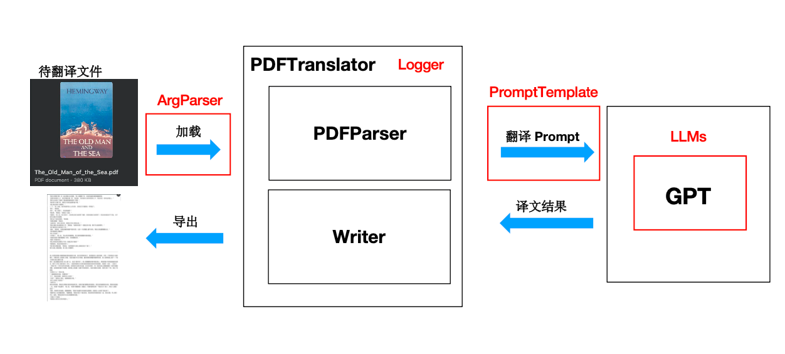

# Translator

## pdfplumber-lab

- [pdfplumber-lab](pdfplumber-lab/pdfplumber.ipynb)：上手使用 pdfplumber 库。

## Architecture

- ArgParser：
- Logger：
- PDFParser：
- Writter：
- Prompt 模块：
- LLMs接入模块：



## Lab

```shell
pip3 install -r requirements.txt
python3 main.py --model_type OpenAIModel --openai_api_key $OPENAI_API_KEY --file_format markdown --config configs/config.yaml --book data/test.pdf --openai_model gpt-3.5-turbo
```

