# ChatGPT

## 简介

GPT（Generative Pre-trained Transformer）基本上是在尝试产生“合理的延续”任何文本，其中“合理”的意思是“在人们看到了亿万个网页等内容后，可能会写出的东西”。想象一下扫描亿万页人类写作的文本（比如在网页和数字化图书中），找到所有这个文本的实例，然后看下一个单词出现的频率是多少。ChatGPT 实际上做的事情有些类似，只不过它不是看字面上的文本，而是在某种意义上寻找“意义匹配”的内容。但最终的结果是它会生成一个排序过的单词列表，这些单词可能是接下来的单词，以及与之对应的“概率”。当 ChatGPT 像写文章这样做事情时，它实际上只是一遍又一遍地问“在给定当前文本的情况下，下一个词应该是什么？”——并且每次都添加一个单词。

### 定义

GPT 是一种使用 Self-regression 自回归模型进行语言建模的预训练模型，和 BERT 一样它也采用了 Transformer 架构，使用了大量未标记的文本进行预训练。GPT 的特点在于它能够自动地生成自然语言文本，可以用于文本生成、对话系统等任务。它采用了无监督的预训练方法，不需要人工标注的数据，可以更好地利用现有的大规模文本语料库。它的独特之处在于它具有非常大的参数量和深度，能够学习到更多的语言知识，并生成更加自然的文本。GPT 模型为上下文的敏感表示设计了通用的任务无关模型 ，它建立在 Transformer decoder 的基础上，预训练了一个用于表示文本序列的语言模型。当将 GPT 应用于下游任务时，语言模型的输出将被送到一个附加的线性输出层，以预测任务的标签。与 ELMo 冻结预训练模型的参数不同，GPT 在下游任务的监督学习过程中对预训练 Transformer decoder 中的所有参数进行 Fine-tuning。

Chat Generative Pre-trained Transformer

- Chat：用来聊天的语言模型。
- Generative：模型训练主要是用来生成下一个字（token）从而可以形成一个序列的 tokens，即“造句”。
- Pre-trained：训练模式。模型是经过预训练的，也就是基于大量历史数据和文本，从而可以“学习”其内在的知识。就是虽然模型没看过你想要解决的问题，比如在情感分析里看到的用户评论和评分。但是模型可以根据很多文本，如网页文章、维基百科里的文章、各种书籍的电子版等，作为理解文本内容（知识）的一个学习资料。不需要对这些数据进行人工标注，只根据这些文本前后的内容，来习得文本之间内在的关联（知识）。
  - 比如，网上的资料里，会有很多“小猫很可爱”、“小狗很可爱”这样的文本。小猫和小狗后面都会跟着“很可爱”，那么我们就会知道小猫和小狗应该是相似的词，都是宠物。同时，一般对于它们的情感也是正面的。这些隐含的内在信息，在做情感分析的时候，就带来了少量用户评论和评分数据里缺少的“常识”，这些“常识”也有助于模型更好地预测。
  - 比如，文本里有“白日依山尽”，那么模型就知道后面应该跟“黄河入海流”。文本前面是“今天天气真”，后面跟着的大概率是“不错”，小概率是“糟糕”。这些文本关系（知识），最后以一堆参数的形式体现出来。对于输入的文本，模型可以根据这些参数计算出一个向量，然后根据这个向量，来推算这个文本后面的内容。
- Transformer：实现的技术。

### GPT演进

GPT-1 走的是生成模式的自回归语言模型路线，比 Bert 出来的还早些。Bert 证明了双向语言模型对于很多 NLP 理解类任务，效果比自回归这种单向语言模型效果更好。尽管如此，GPT-2 并没有因此切换到双向语言模型这条路上，仍然走文本生成的路，而且开始尝试 zero/few  shot prompt。只是因为 zero/few  shot 效果比 Bert+fine-tuning 差的比较远，所以大家都没太当回事，甚至不理解它为什么要始终坚持走单向语言模型的路线。这个时候，即使是 OpenAI 自己也不一定能确保这条路肯定能走通，但这不妨碍它继续在这条路上往后走。GPT-3 已经展示出了比较强大的 zero/few shot  prompt 泛化能力，这时候 OpenAI 心目中的 AGI 已经完全浮出水面，而且它的效果也证明了这条路是有较大可能走得通的。GPT-3 是一个决定 LLM 发展方向的分水岭，与之对应的另外一条路是“Bert+fine-tuning”模式。再往后，就是 InstructGPT 和 ChatGPT了，OpenAI 通过  ChatGPT 证明了一点：虽然我们距离真正的 AGI，可能还有很长的路要走，但是通过超大 LLM 走向 AGI 这条路，目前看是可行的。

#### GPT-1

OpenAI 研究人员在 2018 年提了 GPT-1 模型，GPT-1 属于半监督学习，学习来源为互联网上的书籍与文本上的训练，也因此造成对世界不准确、不完整的认知。GPT-1 于 2018 年 6 月发布，有 1.17 亿参数，采用 5GB 预训练数据。它使用 Transfomer 的 decoder + 二阶段范式，有一定泛化能力，但还很初级。

##### 数据集

GPT-1 使用了 BooksCorpus 数据集，这个数据集包含 7000 本没有发布的书籍。作者选这个数据集的原因有二：

- 数据集拥有更长的上下文依赖关系，使得模型能学得更长期的依赖关系。
- 这些书籍因为没有发布，所以很难在下游数据集上见到，更能验证模型的泛化能力。

##### 架构

GPT-1 是 OpenAI GPT 系列的开山之作。在模型结构方面，GPT 仅使用了 12 层的 Transformer decoder，并对 Transformer decoder 进行了一些改动。原本的 decoder 包含了 MHA 和 MMHA，而 GPT 只保留了 MMHA，这确保了 GPT 只能关注上文的信息，从而达到单向模型的目的。

GPT-1 的核心架构由 Embedding 层、多层 decoder 和前向网络组成：

- 输入层/Embedding 层：将输入的序列转换为词向量。具体来说，Embedding 层使用了一个基于自然语言语料库的预训练模型来学习词向量，将每个单词映射到一个高维向量空间中，使得相似的单词在向量空间中距离较近。
- Block（12层）：decoder block 是 GPT-1 的核心组件，它由 12 个 Transformer decoder block 堆叠而成。每个 block 包含多个 MHA 和 FF 子层，并使用 Add&Norm 来加强模型的表达能力和鲁棒性。多层 block 的作用是将输入的序列逐层编码，得到一系列高层次的语义表示，以支持后续的文本生成和语言理解任务。
- 输出层：它通过将 block 的输出映射到词汇表中的单词，实现对文本的自动化生成。具体来说，输出层由一个 Linear 和一个 Softmax 组成，用于将 block 输出的向量转换为单词概率分布，从而实现实现如分类等不同任务。

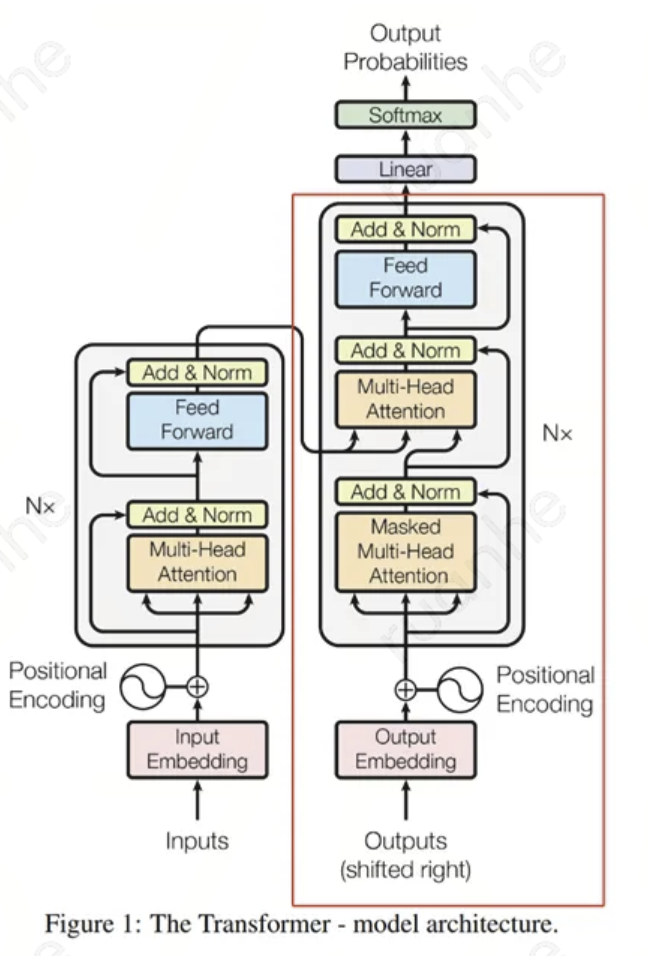

##### 预训练：无监督自回归

传统的 NLP 模型往往使用大量的数据对有监督的模型进行任务相关的模型训练，但是这种有监督学习的任务存在两个缺点：1/ 需要大量标注数据：高质量的标注数据往往很难获得，因为在很多任务中，图像的标签并不是唯一的或者实例标签并不存在明确的边界。2/ 根据一个任务训练的模型很难泛化到其它任务中：这个模型只能叫做“领域专家”而不是真正的理解了NLP。

GPT 采用了 Hinton 等人 2006 年提出的一种经典“二段式范式”。在预训练阶段，首先基于庞大的无标签数据集训练一个生成式语言模型；在微调阶段，使用标注数据继续训练该模型。[GPT-1 的论文](https://www.cs.ubc.ca/~amuham01/LING530/papers/radford2018improving.pdf)（Improving Language Understanding by Generative Pre-Training）第一次使用预训练方法来实现高效语言理解的训练。预训练用现有的文本采用无监督、自回归的方式自动生成训练数据集，而无需标注数据。

- 无监督：其本质就像是猜字游戏。对一个现有文本，遮住下一个 token 进行预测，然后对比预测结果与实际结果，从而调整模型参数。我们手里有很多书籍、文章，我们通过给模型书籍的前 n 个字，让它猜测第 n+1 个字是什么，我们手里有正确的第 n+1 个字，让模型去不断纠正自己。模型为了达到更准确猜中第 n+1 个字的目标，就被迫“学到”了潜在的“世界知识”的表示。就像我们学到了语言的语法、记住了单词、掌握了世界的常识。实际上，我们交给模型的任务，都是“猜下一个词”。
- 自回归：自回归是一种时间序列模型，它利用自身的过去观测值来预测未来的值。在文本生成的上下文中，自回归模型会根据已生成的词序列预测下一个词，每次预测都基于之前的词来进行，因此称为自回归。考虑一个简单的自回归模型，用于预测天气温度。如果我们想预测明天的温度，可以使用今天的温度，再加上过去几天的温度作为参考。例如，明天的温度可能是今天温度的0.8倍，加上昨天温度的0.1倍，再加上前天温度的0.1倍。通过历史数据学习这些权重，我们就能构建一个模型来预测未来的温度。这就是自回归模型的一个简单示例，它根据“自己”的过去值来预测未来值。

##### 微调：Task-specific

当需要处理有监督任务时，可以使用 Task-specific Fine-tuning 的方法，即将预训练模型应用于特定任务并进行微调。GPT-1 的无监督预训练是采用了基于语言模型的预训练方法，即使用已知的部分文本序列预测下一个单词的概率分布。预训练完成后，GPT-1 模型可以用于各种下游自然语言处理任务，例如文本分类、命名实体识别、问答系统等。在这些任务中，可以通过 Fine-tuning 来获得更好的性能，用于与人对齐认知，其作用是从大量响应中给出合理的响应。Task-specific Fine-tuning 通过将无监督的预训练模型迁移到特定任务中，可以有效地利用大规模无标签数据，提高数据效率，达到最先进的模型性能。

假设有一个有标注的数据集，其中每个样本的 input 包含一系列的 token 和一个 label。 将 input 输入到预训练模型后得到输出，然后将输出输入到在 Fine-tuning 阶段新加入的线性输出层预测。

从模型的架构上来说，Fine-tuning 额外加入了线性层和 Softmax 来实现如分类等不同任务。在 Fine-tuning 阶段，可以优化的参数只有顶部的线性层以及用作分隔符的 token embedding。下图展示的就是 GPT-1 做微调时对文本的一些常见做法，其实就是拼接和加分割符之类的操作。

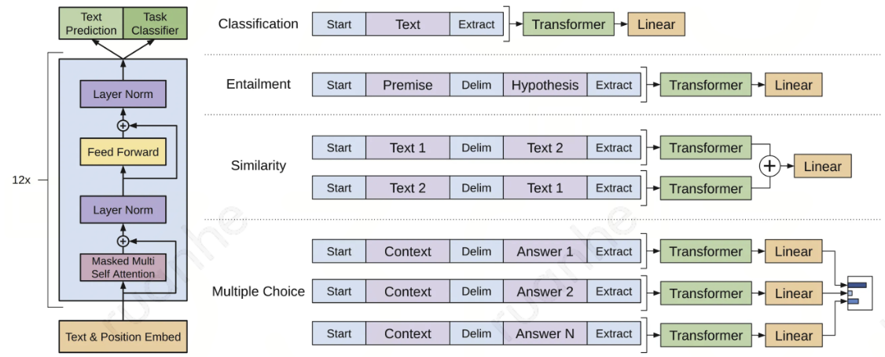

总的来说，GPT-1 的无监督预训练机制通过大规模无标签数据的训练，学习了丰富的语言知识和语言表示，为 NLP 任务提供了强大的基础。然后在进行模型输出时，利用特定的下游任务进行有监督的 Task-specific Fine-tuning。

##### 贡献

###### 验证“二段式范式”


#### GPT-2

GPT-1 需要对特定任务再进行 Task-specific Fine-tuning（依赖有标签数据进行监督学习），而 GPT-2 则是考虑在预训练时考虑各种不同的任务，也就更加通用化。GPT-2 于 2019 年 2 月发布，有 15 亿参数，采用 40GB 预训练数据，并且优化了网络架构、提升了参数和预训练数据，因此在生成方面更强了，能够阅读摘要、聊天、编故事等。其核心思想是：**可以直接用无监督的预训练模型直接去做有监督任务，而不需要做微调。** 

##### 数据集

GPT-2 的文章取自于 Reddit 上高赞的文章，命名为 WebText。数据集共有约 800 万篇文章，累计体积约 40G。为了避免和测试集的冲突，WebText 移除了涉及 Wikipedia 的文章。

##### 预训练：Masked建模

Masked 建模的具体做法是模型不仅需要预测下一个单词，还需要在输入文本中的一些位置上预测被遮蔽的单词。具体来说，输入文本中的一些单词将被随机遮蔽，模型需要通过上下文来预测这些被遮蔽的单词。这种任务要求模型不仅要理解语言的上下文关系，还要有填充缺失信息的能力。这么做的目的是为了提高训练效率，它提供了更多的训练信号，使模型能够学习到更多的语言规律和语义理解。

##### 微调：无需Task-specific Fine-tuning

GPT-2 在模型结构方面和 GPT-1 完全一致，预训练的任务也没有改变。GPT-2 的核心思想是使用预训练模型来解决下游任务，即可以将无监督学习的预训练模型直接应用于有监督的任务。这种方法的基本假设是，通过在大规模的无标签数据上进行预训练，预训练模型已经学会了大量的语言知识和语言表示，并且这些知识可以被迁移和应用于各种下游任务中。实际上有监督任务的监督信号是会出现在无监督任务的语料中的，只要语料足够大，那么就能 cover 到多个任务。因此，只要**模型参数量足够大**、**预训练语料足够丰富**，那么无监督预训练得到的预训练模型就能直接拿来执行多任务。

GPT-2 验证了通过扩大参数规模和预训练数据集的规模就可以迁移到多个任务且不需要额外的 Task-specific Fine-tuning。除了预测下一个单词，还支持文本分类、情感分析、命名实体识别、翻译等。尽管其在有些任务上表现得不够好，但其已经初步展现了大模型大数据集 zero/few shot 的潜力，未后续大模型的发展提供了有依据的方向。

##### 贡献

###### 初步验证预训练模型的泛化能力（无需微调）


#### GTP-3

GPT-3 可以理解为 GPT-2 的升级版，于 2020 年 5 月发布，有 1750 亿参数，采用了45TB 预训练数据（但过滤后其实只有 570G 的数据）。其更优的技术架构、更大参数规模（100倍）和数据量（1000倍），奠定了现在 GPT 的基础，可以完成绝大部分 NLP 任务，写代码、创作诗歌、生成剧本、模仿哲学家等。

相对于 GPT-2，GPT-3 模型规模更大，这种规模的增加使得 GPT-3 可以学习更丰富的语言知识和语言表示。GPT-3 在多方面的能力都得到了提升，包括生成、理解、推理等。GPT-3 可以生成更加自然流畅的文本，具有更好的一致性和逻辑性。同时，GPT-3 还可以理解更加复杂的语言结构和语义关系，可以进行更加高级的推理和自然语言推断。

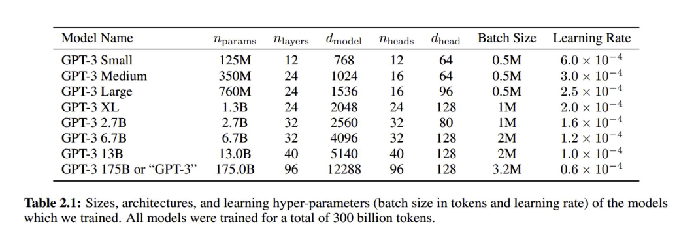

##### 数据集

GPT-3 使用了比 GPT-2 更大的数据集进行训练，包括从互联网上爬取的大量文本数据和其他来源的数据集。这些数据集包括了多种类型的语言，可以使得 GPT-3 具有更广泛的应用能力和更好的泛化性能。

GPT-3 共训练了 5 个不同的语料，分别是低质量的 Common Crawl、高质量的 WebText2、Books1、Books2 和 Wikipedia，GPT-3 根据数据集的不同的质量赋予了不同的权值，权值越高的在训练的时候越容易抽样到。

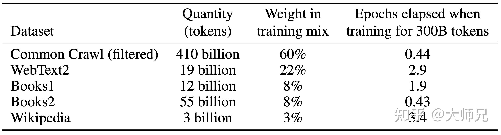

##### 预训练：超大模型参数

GPT-3 提供容量足够大的 Transformer 模型来对语言模型进行建模。而近年来使用大规模的网络来训练语言模型也成为了非常行之有效的策略，这也促使 GPT-3 一口气将模型参数提高到 1750 亿个。

其实对 LLM 发展理念的理解，就是“构建一个任务无关的超大型 LLM，让它从海量数据中学习各种知识”，这一点几乎是大家的共识。这也为用一个模型搞定各种任务提供了理论基础，这个模型是大参数基座语言模型（GPT-3.5），大模型的大是指海量参数，从而能吸取海量数据中的信息，这是在 Transformer 之后成为可能的。从 GPT-1 到 GPT-3 的演化中，也主要是预训练的变化：数据量扩大 400 倍，模型参数扩大 1500 倍，更大的模型记忆了更多的基础知识。

##### 对齐：In-context Learning

与人的意图对齐

In-context learning 就是利用当前会话的上下文信息进行学习，利用模型对上下文进行理解，让它能自动推断出任务的需求。在处理每个新的 prompt 时，模型都会利用当前的上下文进行“学习”，这种“学习”实际上是通过调整模型的内部状态（而非模型参数）来适应新的上下文。每次调用都会给模型提供一系列的输入，让模型根据这些输入的上下文信息来推断任务的要求。当输入一个新的 prompt 时，模型会将这个 prompt 与其前面的上下文一起处理。把问题和回答都当成字符串连接起来，结构是：输入问题里所有的词，生成回答的第 N+1 个词。如果进行第二轮对话。输入就变成了：输入第一个问题里所有的词+第二个问题的所有词，输出第二个回答的第 N+1 个词。这个“上下文”可以包括当前会话中的先前对话，也可以包括特定的知识或信息，模型会根据这个上下文以及新的提示生成响应。

比如翻译任务可以采用输入：“请把以下英文翻译为中文：Today is a good day”，。通过 In-context learning 的方式，GPT-3 可以在不需要针对性微调的情况下，对领域特定的语言进行适应和优化，从而在特定领域的应用场景中达到更好的效果。同时，这种方法也可以提高模型的灵活性和可扩展性，使其可以适应更多不同的领域和任务。

###### Vs. Fine-tuning

做微调时，LLM 想要在特定任务上取得较好效果，也需要那个领域的具体数据去微调一下。通过大量的例子，先教给模型那个领域中什么是好、什么是坏，调节一下模型的权重，从而输出恰当的结果。这样的应用明显非常有局限，每做一些新的事情都要重新训练一遍模型。而新事情和新数据无穷无尽，模型就只能刷新。但是模型的刷新也可能导致过去做得好的事情突然做不好了，进一步限制了应用。“过往的 fine-tuning”需要更改模型参数，也就是说换了个新模型。

但是 In-context Learning，模型并没有变化，却能在新数据上表现更好。

长期记忆 vs. 短期记忆

- 长期记忆（fine-tuning）：实现长期记忆最好的方法是将整个 LLM 进行 Fine-tuning，将想要它记住和理解的内容调整到模型的权重中。
- 短期记忆（prompt）：每次输入新问题时，同时输入需要记忆的内容，类似于短期记忆。

##### 贡献

###### 验证预训练模型的泛化能力

GPT-3.5 的泛化能力的表现为在现有的预训练模型的基础上，无需进行微调，通过构造特定领域的 prompt 引导预训练模型的输出，进一步提高模型在下游任务的性能和适用性。GPT-3 在 zero-shot 方面表现出更强的能力，它打出的口号就是“告别 Task-specific Fine-tuning 的 GPT-3”，它可以通过不使用一条样例的 zero-shot 来完成任务。GPT-3 可以通过对任务和输入的描述（In-context Learning）自动推理出任务的答案，而无需进行任何样本的学习，zero-shot 更加强调模型的泛化能力。

###### 初步验证预训练模型的推理能力

在 few-shot 方面，GPT-3 可以使用极少量的样本来完成任务，并展现出模型很好的推理能力能力。few-shot 更侧重于利用有限的标注数据来学习和推广到新的任务。

只有当参数规模达到数百亿级后，模型具备了一定的推理能力。也就是说模型在不需要训练情况下，只需要给几个新任务的示例，模型就可以做出正确的预测。通过把参数增加到 1750 亿，真地学到了‘世界知识’。学到了这些潜在的‘表示/特征’之后，只需要再让模型学一个任务的少量几个 case，模型就能学进一步学到我们给的几个 case 里的潜在的'特征'，即这几个 case 所表达的规律和逻辑。

#### GPT-3.5/InstructGPT

InstructGPT 于 2022 年 1 月发布，它基于 GPT-3 微调。但重要的是强化学习人类反馈（RLHF），可以将有害的、不真实的和有偏差的输出最小化，从而实现更贴近人类偏好的能力。

##### 数据集

因为InstructGPT/ChatGPT是在GPT-3基础上做的微调，而且因为涉及了人工标注，它们数据总量并不大，表2展示了三份数据的来源及其数据量。

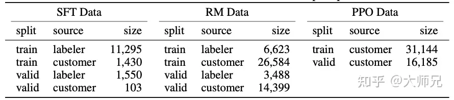

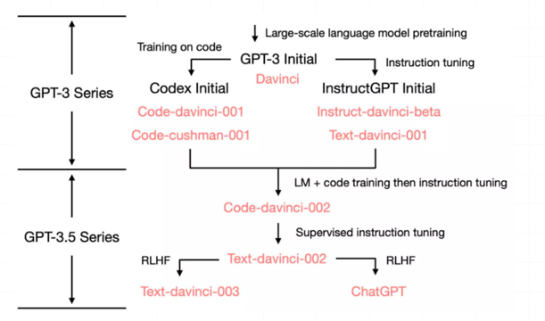

##### 预训练

###### Codex代码模态

代码模态的目的是可以输入、输出代码，可以用于纠错、生成代码。其实现实现方式是在预训练阶段给模型喂大量代码。Codex 论文中的代码数据量为 159G ，大约是初代 GPT-3 5700 亿训练数据的 28%。

它很有可能借鉴了OpenAI 著名的代码生成算法 CodeX。CodeX 是 GPT-3 的下一代模型，并提高模型的编程能力，是再合理不过的工作了。

##### 微调

###### Instruction Tuning

Instruction tuning 是一种用于微调语言模型，以使其在特定任务或领域中表现更好。在 GPT-3 中，Instruction Tuning 的目的是通过引入特定领域的示例或指令来调整模型的行为，以更好地适应该任务或领域的需求。

具体来说，Instruction Tuning 包括以下步骤：

- 提供示例：首先，为特定任务或领域提供一系列示例或指令。这些示例可以是对话、问题-答案对、文本片段等，它们代表了模型在特定情境下期望的输出。
- 调整模型参数：接下来，使用提供的示例来微调模型的参数。这意味着通过在模型的训练过程中重点关注这些示例，调整模型的权重和参数，以最大程度地适应示例中的语言和逻辑结构。
- 评估性能：微调完成后，评估模型在特定任务或领域中的性能表现。这可能涉及使用评估数据集或进行人工评估，以确定模型是否达到了预期的性能水平。
- 迭代优化：根据评估结果，进行进一步的调整和优化，直到达到满意的性能水平为止。

举例来说，假设我们要使用 Instruction Tuning 来改进 GPT-3 在法律文件摘要生成任务上的性能。我们会提供大量法律文件以及其摘要作为示例，并将这些示例用于微调模型。通过这个过程，模型将学习到法律领域的专业术语、逻辑结构和摘要生成的模式，从而在生成法律文件摘要时表现更为准确和合理。

###### Supervised Instruction Tuning

Supervised Instruction Tuning 也是通过提供示例，但与 Instruction Tuning 不同的是，这里的示例带有明确的监督信号，用于指导模型的学习。具体来说，示例中包含了输入和期望的输出，模型在微调过程中直接以监督的方式学习输入和输出之间的映射关系。这种方式下，模型通过示例直接获得了监督信号，从而更加准确地调整自己的参数。

举例来说，假设我们要使用 supervised instruction tuning 来改进 GPT-3 在情感分析任务上的性能。我们会提供大量的文本数据以及对应的情感标签作为示例，其中文本数据是输入，情感标签是期望的输出。在微调过程中，模型将直接根据文本数据和情感标签的对应关系进行参数调整，以最大程度地准确预测文本的情感极性（如积极、消极或中性）。这种方式下，模型在微调过程中直接受到了监督信号的指导，从而更加准确地适应了情感分析任务的需求。

在 Supervised Instruction Tuning 阶段提供更多“Instruction-最佳响应”的数据对，这种方法涉及使用包含明确指令的特定数据集来调整模型。例如，这个数据集可能包含一个指令（如"给我一个蛋糕的食谱"）和一个适当的回应（如一个详细的蛋糕食谱）。通过在这种数据集上进行 fine-tuning，模型学习如何根据给定的指令产生适当的回应。

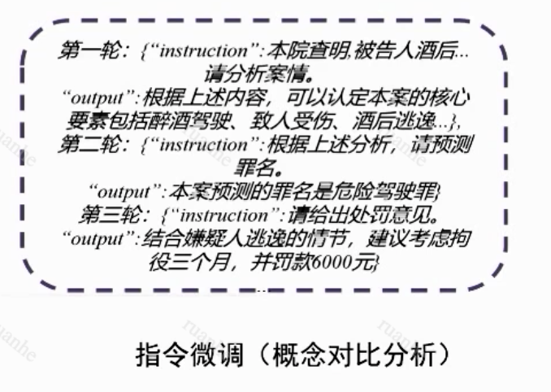

##### 对齐：RLHF

与人的价值观对齐

之前的答案是合理的，但不是人最满意（不符合人的价值观）。对于什么是好的回答，什么是不好的回答，人类有自己的标准，例如比较详细的回答是好的，带有歧视内容的回答是不好的，诸如此类。这是人类自身对回答质量好坏的偏好。人通过 Reward Model 反馈给 LLM 的数据里，包含这类信息。总体而言，ChatGPT 把人类偏好知识注入 GPT-3.5，以此来获得一个听得懂人话、也比较礼貌的 LLM。RLHF 的作用是在多个合理的响应中挑选出最佳响应。 

在 GPT-3.5 中使用 RLHF 的目的是与人的价值观对齐，是为解决模型有时不能遵循用户意图而诞生的。有时候我们希望模型并不仅仅只受训练数据的影响，而是人为可控的。论文中多次提到了对齐（Alignment）问题，我们可以理解为模型的输出内容和人类喜欢的输出内容的对齐，人类喜欢的不止包括生成内容的流畅性和语法的正确性，还包括生成内容的有用性、真实性和无害性。“不能遵循用户意图”表示模型可能会生成不真实、有毒或对用户毫无帮助的输出。主要原因是模型的训练目标是预测下一个 token 而不是有帮助地和安全地遵循用户的指令。换句话说，这些模型与其用户没有对齐。这是由于模型的偏见性和数据中存在的一些有毒内容导致模型会输出无用的、有毒的输出（LM 并没有对输出是否无用、是否有毒的监督）。因此，InstructGPT 要做的就是使模型的输出符合人类的意图。这种改进是十分有必要的，尤其是当模型被部署在多个应用场景中时。具体而言，InstructGPT 的优化目标有 3 个（3H）：1/ Helpful：模型应该帮助用户解决他们的任务；2/ Honest：模型不应该编造信息来误导用户；3/ Harmless：模型不应对人或环境造成身体、心理或社会伤害。

通过“Reword 模型+PPO”框架实现了 RLHF，它使用了人类训练师进行训练，他们评估并排名了模型的提示响应。这个反馈然后被纳入到模型中，以 Fine-tuning 其答案，使其更符合训练者的喜好。这是一种训练过程，其中人类训练师评估和排名模型的不同响应，然后这些排名被用来创建一个奖励模型，该模型随后用于训练模型。人类训练师首先会提供反馈，评价和排名模型对各种提示的响应。然后，这些评价和排名被用来创建一个奖励模型，该模型能够预测人类训练师对模型响应的评价。最后，这个奖励模型被用于通过强化学习进一步训练模型。这个过程被重复进行，每一次迭代都使模型更好地理解并执行用户的指令。

###### Reward Modeling

在 ChatGPT 的三阶段训练法中的第二阶段是 Reward Modeling。在这个阶段，模型学习如何根据其生成的输出获得奖励信号，以引导其产生更合适的回复。

在 Reward Modeling 中，通常会定义一个奖励函数，用于评估模型生成的每个回复的质量。这个奖励函数可以根据任务的不同而不同，它可以基于对话的连贯性、信息的准确性、回答的相关性等因素来评估模型的表现。

举个示例，假设我们正在训练一个 ChatGPT 模型来进行智能对话，我们希望模型能够生成合适、连贯的回复。在 Reward Modeling 阶段，我们可以定义一个奖励函数，比如基于语言模型的概率分数或人类评价的得分，来评估模型生成的每个回复的质量。如果生成的回复被认为是合适和连贯的，那么模型会得到积极的奖励信号；如果生成的回复不合适或不连贯，那么模型会得到负面的奖励信号。

通过奖励建模阶段，模型可以学习到如何生成更合适和连贯的回复，因为它可以通过奖励信号来调整其生成策略，以最大化预期的奖励。

###### PPO

PPO 是一种常用的增强学习算法，用于训练模型执行特定任务，并在执行过程中最大化预期的 Reward。在 PPO 阶段，模型会与环境进行交互，并根据其生成的动作（即回复）获得奖励信号。PPO 算法会利用这些交互数据来更新模型的参数，以使模型能够生成更好的回复，并最大化预期的累积奖励。

举个示例，假设我们正在训练一个 ChatGPT 模型来进行智能对话。在 PPO 阶段，模型会与环境进行交互，生成回复并接收奖励信号。如果生成的回复被认为是合适和连贯的，那么模型会得到积极的奖励信号；如果生成的回复不合适或不连贯，那么模型会得到负面的奖励信号。PPO 算法会利用这些奖励信号来更新模型的参数、调整模型的生成策略以最大化预期的累积奖励。

通过 PPO 阶段，模型可以逐步改进其生成的回复质量，因为它会根据与环境的交互获得的奖励信号来调整自己的行为。这样，模型就能够学会生成更加合适和连贯的回复，以更好地完成对话任务。

##### 贡献

###### 进一步验证预训练模型的泛化能力

直接使用 Instruct 就可以进行任何操作，其表现的效果就是 zero-shot，充分理解用户意图。

具体而言，zero-shot 的初衷就是人类和 LLM 的理想接口，直接用人类所习惯的任务表述方式让 LLM 做事情，但是发现 LLM 并不能很好地理解，效果也不好。zero-shot 其实就是现在的 Instruct 的效果，以前大家习惯叫 zero-shot，现在很多改成叫 Instruct。

###### 涌现能力

2021 年，OpenAI 的几个研究者在训练神经网络过程中有一个意外发现 。打个比方，比如说你在教一个学生即兴演讲。他什么都不会，所以你找了很多现成的素材让他模仿。在训练初期，他连模仿这些素材都模仿不好，磕磕巴巴说不成句子。随着训练加深，他可以很好地模仿现有的演讲了，很少犯错误。可是如果你给他出个没练过的题目，他还是说不好，于是你就让他继续练。继续训练好像没什么意义，因为现在只要是模仿他就都能说得很好，只要是真的即兴发挥他就不会。但你不为所动，还是让他练。就这样练啊练，突然有一天，你惊奇地发现，他会即兴演讲了！给他一个什么题目，他都能现编现讲，发挥得很好！

这就是量变产生质变，研究者把这个现象称为“开悟”（Grokking）。再举个例子，ChatGPT 有个很关键的能力叫做 few-shot，就是你给它一两个例子，它就能学会你的意思并且提供相似的输出。而 few-shot 只是其中一项能力，还有很多别的能力也是如此：大了，它们就出来了。这个现象其实就是科学家之前一直说的“涌现”（Emergence）。涌现的意思是当一个复杂系统复杂到一定的程度，就会发生超越系统元素简单叠加的、自组织的现象。比如单个蚂蚁很笨，可是蚁群非常聪明；每个消费者都是自由的，可是整个市场好像是有序的；每个神经元都是简单的，可是大脑产生了意识…… 万幸的是 LLM 也会涌现出各种意想不到的能力。2022 年 8 月，谷歌大脑研究者发布一篇论文 ，专门讲了 LLM 的一些涌现能力，包括少样本学习、突然学会做加减法、突然之间能做大规模、多任务的语言理解、学会分类等等…… 而这些能力只有当模型参数超过 1000 亿才会出现。研究者并没有刻意给模型植入这些能力，这些能力是模型自己摸索出来的，就如同孩子长大往往会出乎家长的预料。

之前的 GPT-3 本质上是对训练数据的拟合，还未展现“涌现”能力。而 GPT-3.5 “涌现”出了总结、推理等逻辑分析能力，其展现的功能就是如 ew-shot。而“涌现”出现的原因是通过“模型规模的巨大”和“读取代码的逻辑性” 2 方面产生的。GPT-3.5 是完全通过自学，摸到了这些思考能力。语言模型之所以有这样的神奇能力，主要是因为它们足够大。GPT-3.5 有 1750 亿个参数。这是只有在今天才能做到的事情，以前不用说算力，光是存储训练模型的语料的花费都是天文数字。1981年，1GB 的存储成本是 10 万美元，1990 年下降到 9000 美元，而现在也就几分钱。你要说今天的 AI 科学跟过去相比有什么进步，计算机硬件条件是最大的进步。今天我们做的是“大”模型，大就是不一样 。当模型足够大时，用于训练的语料足够多，训练的时间足够长，就会发生一些神奇的现象。另一方面，GPT-3.5 读了大量代码，从而有了“涌现”的能力。不光能读懂和生成代码，对语言本身的理解和推理能力也解锁了。

###### 推理能力

经过研究发现：对于某项任务，如果给 LLM 几个示例，用这些示例来代表任务描述，效果会比 zero-shot 好，这就是所谓的 few-shot。few-shot 就是给 LLM 几个示例作为范本，然后让 LLM 解决新问题。


如果理解了上述逻辑，很容易得出如下结论：few-shot 只是一种过渡时期的技术。如果我们能够更自然地去描述一个任务，而且 LLM 可以理解，那么，我们肯定会毫不犹豫地抛弃这些过渡期的技术，原因很明显，用这些方法来描述任务需求，并不符合人类的使用习惯。

推理能力的关键机制是“思维链” CoT（Chain-of-Thought）。简单说，思维链就是当模型听到一个东西之后，它会嘟嘟囔囔自说自话地，把它知道的有关这个东西的各种事情一个个说出来。比如你让模型描写一下“夏天”，它会说：“夏天是个阳光明媚的季节，人们可以去海滩游泳，可以在户外野餐……”等等。思维链是如何让语言模型有了思考能力的呢？也许是这样的。思维链可以进行复杂推理，使用思维链进行复杂推理的能力很可能是代码预训练的一个神奇的副产物。最初的 GPT-3 没有接受过代码预训练，它不能做思维链，所以 Instruct Fine-tuning 可能不是思维链存在的原因，代码预训练才是模型能做思维链推理的最可能原因。

只要思考过程可以用语言描写，语言模型就有这个思考能力。给模型看一张图片——皮克斯电影《机器人总动员》的一张剧照——问它是哪个制片厂创造了图中的角色。如果没有思维链，模型会给出错误的回答。怎么用思维链呢？可以先要求模型自己把图片详细描述一番，它说“图中有个机器人手里拿了一个魔方，这张照片是从《机器人总动员》里面来的，那个电影是皮克斯制作的……”。这时候你简单重复它刚说的内容，再问它那个角色是哪个制片厂创造的，它就答对了。既然如此，只要我们设置好让模型每次都先思考一番再回答问题，它就能自动使用思维链，它就有了思考能力。有人分析 ，思维链很有可能是对模型进行编程训练的一个副产品。我们知道现在 GPT-3.5 是可以帮程序员编程的。在还没有接受过编程训练的时候，它没有思维链。也许编程训练要求模型必须得从头到尾跟踪一个功能是如何实现的，得能把两个比较远的东西联系在一起——这样的训练，让模型自发地产生了思维链。

#### GPT-4

GPT-4 的整体实现逻辑、架构与 ChatGPT 类似，可以将其看作是拥有更长上文、更好理解复杂指令、回答更可靠、更风格化、更有创意的图文版升级 ChatGPT。于 2023 年 3 月发布，估计拥有 18000 亿参数。

- 支持更长的上下文窗口：其最多支撑 32K 的上下文。
- 复杂任务处理能力：GPT-4 在更复杂、更细微的任务处理上，回答更可靠、更有创意，这在多类考试测验中以及与其他 LLM 的 benchmark 比较中得到。

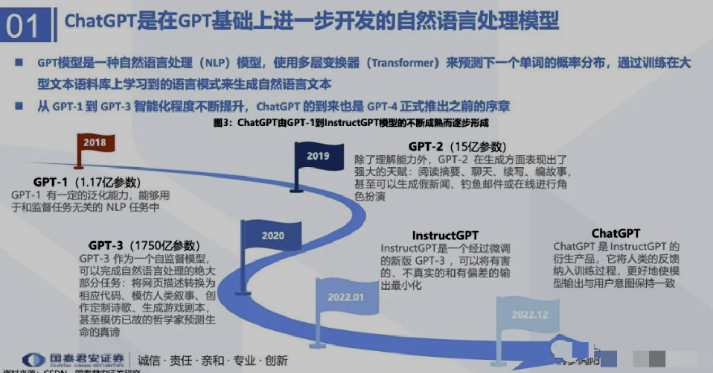

##### 多模态

接受图像和文本输入、输出为文本，突破纯文字的模态，增加了图像模态的输入，具有强大的图像理解能力。


##### 特性

###### 图标理解能力

因为 GPT-4 是支持图像格式的图表输入的，OpenAI 著名的多模态算法 CLIP 讲的是我们可以通过对比学习将图像和文本映射到同一特征空间，如下图。那么结合 CLIP 的图像 encoder 便可以实现 GPT-4 的图像输入，这时我们需要训练一个可以和 GPT 的文字特征对齐的图像 encoder，然后将 CLIP 的图像 encoder 的输出作为图像 token，最后再加一个 embedding 层将这个 token 编码为 GPT-4 的特征向量。

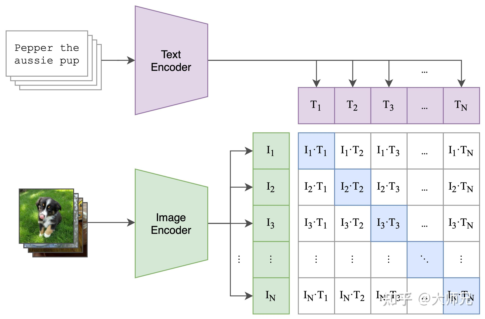

###### 自我提升能力

LLM 和 CoT 的结合可以让模型使用无监督的数据进行自我提升（Self-improve），它的核心方法如下图所示。GPT-4 也指出他们使用了自提的方案来提升模型的遵循用户意图的能力。

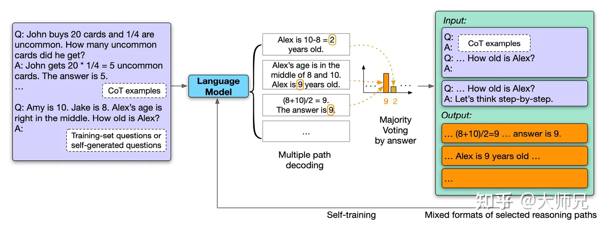

它的计算过程如下：

- 首先我们基于 CoT 构建提示；
- 根据不同的 Temperature 系数，模型生成多个不同的包含推理过程的 Path；
- 我们使用投票的方式选择最有可能的正确答案；
- 将包含这个正确答案的所有 Path 用来优化LLM。

你可能已经发现这个方法得到的答案并不一定是正确的答案。作者通过实验得出了两个重要结论：

- 答案的正确率和它的置信度是高度相关的，也就是说通过投票得到的答案很有可能是生成的答案中最正确的那个；
- 即使答案是错误的，将它们加入到训练数据中也有助于模型的训练。

在得到了推理 Path 之后，作者根据这个 Path 构建了四种不同的输入数据，它们分别是：

- 标准的 CoT 提示，即构建（问题，思维链，答案）三元对；
- 传统的提示学习，即只有问题和答案；
- 输入是问题，添加“Let's think step by step”提示，让模型预测推理步骤；
- 传统的QA，即输入问题，预测答案。

最后，为了丰富数据集，作者提出了两个方案来扩充数据：一是随机组合两个问题，然后让模型生成新的问题；二是让模型生成推理步骤，并将它加入到训练集中。

#### ChatGPT

ChatGPT 与 2022 年 11 月发布，它是 InstructGPT 的衍生产品，优化了人类反馈的训练过程，能够更好地使模型输出与用户偏好保持一致，并且在内容安全上有了一些优化。

ChatGPT 是一种基于对话数据训练的对话语言模型，在 GPT-3 的基础上针对会话任务进行了 Instruct Fine-tuning，使它在面对问答、文本生成时能生成更类似人类的答案，所以在进行提示时给 ChatGPT 设定本次会话的“人设”效果会很好。ChatGPT 在 RLHF 的帮助下，找到了 GPT-3.5 和人类自然语言的合理接口，解锁了模型应用的前景。厉害的模型是 GPT-3.5，厉害的应用方式是 ChatGPT。

#### 几代GPT对比

|                       | GPT-1                      | GPT-2        | GPT-3        |
| :-------------------- | :------------------------- | :----------- | :----------- |
| 时间                  | 2018年6月                  | 2019年2月    | 2020年5月    |
| 参数量                | 1.17亿                     | 15.4亿       | 1750亿       |
| 预训练数据量          | 5GB                        | 40GB         | 45TB         |
| 训练方式              | Pre-training + Fine-tuning | Pre-training | Pre-training |
| 序列长度              | 512                        | 1024         | 2048         |
| Decoder Layers        | 12                         | 48           | 96           |
| Size of Hidden Layers | 768                        | 1600         | 12288        |

### 设计原则

OpenAI 的 Ilya 对 GPT的设计理念是认为：**语言模型是对信息的压缩，所以他希望 GPT 能压缩整个世界的知识**。本质上说，LLM 就是对数据进行有损压缩（大约 10TB 文本），模型就等于靠这些数据对世界形成了理解。Ilya 认为，如果能高效压缩信息，就一定已经得到知识，不然是没法压缩信息。所以，把信息高效压缩的话，you got to have some knowledge（你得有一些知识）。这与沃尔夫勒姆的想法相似，他认为，语言思考的本质是在寻求规律，而规律是对客观世界的一种压缩。而 LLM 的一个核心能力是对“人类知识的压缩”，或者讲知识抽象。个人认为知识抽象的能力，可以将 AIGC 看作通用人工智能的“表”，而将“知识抽象”看作通用人工智能的“里”。

#### 训练数据质量高&量大

因为需要压缩整个世界的知识，所以需要训练数据能包含整个世界的知识，需要量大且质量高。

关于预训练数据对模型效果的影响，Google T5 做了大量对比实验，目前的结论是：在保证预训练数据质量的前提下，数据规模越大模型效果越好。这里需要注意的是，数据规模越大越好，这点其实从 BERT 一出来就是一个容易想到的重要因素。因为数据量越多，数据里蕴含的知识也越多，那么模型能学到的东西越多，所以模型效果会更好。但的前提是数据质量要高，光数据量大不行，很多乱七八糟的数据反而会对模型效果带来负面影响。

#### 模型容量大&深度深

所谓增加模型容量及复杂度，指的是增加 Transformer 模型的参数量。LLM 通常具有大量的参数，这些参数用于学习和表示语言的复杂结构、语法和语义。参数数量越多，模型的表示能力和学习能力就越强，一些知名的 LLM，如 GPT-3，具有数百亿个参数。

##### 容量大

GTP 已经压缩了整个世界的信息，Ilya 坚信 GPT-3、GPT-3.5、GPT-4 已经有一个世界模型在里面。虽然它们做的事是预测下一个关键词，这只不过是优化手段。模型已经表达了世界的信息，而且它能持续地提高模型能力，尤其是目前研究比较多的在子概念空间当中做泛化。这是 OpenAI 在思想上的“超越性”，这种思想上的“超越性”也可以理解为其对于技术信仰的坚守——他们相信靠大量的语料和海量的计算，能够产生出对于知识的沉淀和应用。如果仔细看微软的这篇论文[《GPT-4：通用人工智能的火花》](https://arxiv.org/abs/2303.12712)大家就会惊讶于 LLM 对于人类各领域知识掌握的深度和广度，就不会嘲笑大模型一时的“一本正经胡说八道”。而是会对 AGI 可能对整个人类社会的革命性影响有足够高的敬畏。这样的能力，将使得大模型会革新一切“知识密集性行业”。

因为要记住足够全面的“世界知识”，是不是至少要有足够大的模型容量。按照 GPT-3 的论文来说，当参数量达到 1750 亿的时候，模型就能记住这个世界的“世界知识”所需要的所有‘特征’的‘表示’了。每个参数用 16 位的浮点数保存，体积是 320G。这个世界的‘世界知识’，被这 320G 的数据表示了。

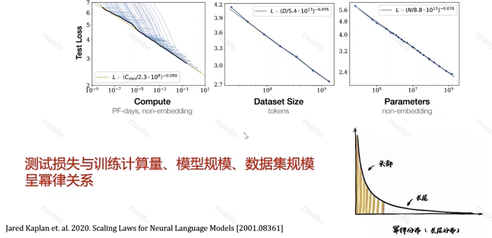

##### 深度深

另一个重要点是模型要足够深，才能无监督地去探索 AGI，只有通过多层的抽象才能获得本质的规律。LLM 从海量文本中学习了大量知识，如果把这些知识做粗略分类的话，可以分为语言类知识和世界知识两大类：

- 语言类知识：指的是词法、词性、句法、语义等有助于人类或机器理解自然语言的知识。关于 LLM 能否捕获语言知识有较长研究历史，自从 Bert 出现以来就不断有相关研究，各种实验充分证明 LLM 可以学习各种层次类型的语言学知识，这也是为何使用预训练模型后，各种语言理解类自然语言任务获得大幅效果提升的最重要原因之一。另外，各种研究也证明了浅层语言知识比如词法、词性、句法等知识存储在 Transformer 的低层和中层，而抽象的语言知识比如语义类知识，广泛分布在 Transformer 的中层和高层结构中。
- 世界知识：指的是在这个世界上发生的一些真实事件（Factual Knowledge 事实型知识），以及一些常识性知识（Common Sense Knowledge）。比如“拜登是现任美国总统”、“拜登是美国人”、“乌克兰总统泽连斯基与美国总统拜登举行会晤”，这些都是和拜登相关的事实类知识。而“人有两只眼睛”、“太阳从东方升起”这些属于常识性知识。关于 LLM 模型能否学习世界知识的研究也有很多，结论也比较一致：LLM 确实从训练数据中吸收了大量世界知识，而这类知识主要分布在 Transformer 的中层和高层，尤其聚集在中层。而且，随着 Transformer 模型层深增加，能够学习到的知识数量逐渐以指数级增加。其实，你把 LLM 看作是一种以模型参数体现的隐式知识图谱，如果这么理解，我认为是一点问题也没有的。

“When Do You Need Billions of Words of Pre-training  Data?”这篇文章研究了预训练模型学习到的知识量与训练数据量的关系，它的结论是：对于 Bert 类型的语言模型来说，只用 1000 万到 1 亿单词的语料，就能学好句法语义等语言学知识，但是要学习事实类知识，则要更多的训练数据。这个结论其实也是在意料中的，毕竟语言学知识相对有限且静态，而事实类知识则数量巨大，且处于不断变化过程中。而目前研究证明了随着增加训练数据量，预训练模型在各种下游任务中效果越好，这说明了从增量的训练数据中学到的更主要是世界知识。

LLM 确实从数据中学到了很多语言类及世界知识。那么，对于某条具体的知识，LLM 把它存储到了哪里？显然，知识一定存储在 Transformer 的模型参数里。从 Transformer 的结构看，模型参数由两部分构成：MHA 部分占了大约参数总体的三分之一，三分之二的参数集中在 FF 结构中。MHA 主要用于计算单词或知识间的相关强度，并对全局信息进行集成，更可能是在建立知识之间的联系，大概率不会存储具体知识点，那么很容易推论出 LLM 模型的知识主体是存储在 Transformer 的 FF 结构里。

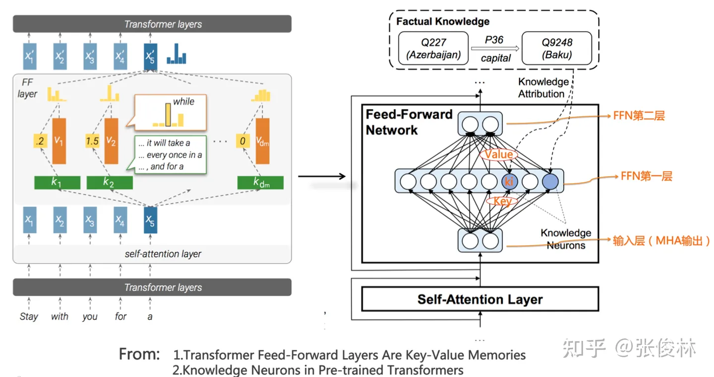

最直接的增加模型容量的方式就是增加 Transformer 层深，比如可以从 BERT-Base 的 12 层增加到 BERT-Large 的 24 层，还可以继续增加到 36 层。这是纵向增加复杂度，Google T5 走的就是这条路。除此外，还可以横向增加模型复杂度，比如在固定 Transformer 层深的情况下，可以通过放大 Transformer 中构件的大小，比如 Hidden Size 的大小、FF 层对隐层的大小、MHA 的 Attention Head 的数量等多种方式来做到这一点。ALBERT 走的这条路，它的 xxLarge 模型效果最好，只用了 12 层 Transformer，但是 Hidden Size 达到了 4096。这两种模式还可以相互结合，就是同时纵向和横向增加模型复杂度，GPT-3 即是如此，将模型复杂度这点推到了极致。单词特征的 Embedding 不会放的太大，一般采用 64 或 128 大小，ALBERT 证明了如果单词特征 Embedding 跟着 Transformer 内部的 Hidden Size 同步放大，效果反而会降低。也就是说，增加模型容量指的是放大 Transformer 模型本身的参数量，但不包括输入层 Embedding 的参数。

然而，随着参数数量的增加，训练和推理过程需要的计算资源和时间也会显著增加。

#### 训练复杂度高&更充分

大语言模型在训练过程中使用了大量的文本数据。这些数据通常来自互联网、书籍、论文等各种来源，覆盖了广泛的主题和领域。通过在大规模数据上进行训练，模型可以学习到更丰富、更通用的语言知识。然而，处理如此大规模的数据需要强大的计算资源和高效的训练算法。

- 复杂度高：采用多种不同类型的训练方式。
- 更充分：这里所谓的“更充分”，一般指的是放大 Batch Size、增加预训练步数，就是 RoBERTa 做的那两个事情。

#### 为人所用

- Alignment（与人的意图对齐）：通常指的是在处理多语言或跨语言任务时，将不同语言的词汇、句子或段落对应起来的过程，它的目的是为了提高模型的易用性。基于 Alignment 工程，ChatGPT 通过强大的 Instruct Fine-tuning 和自然语言对齐，后续也可以跟代码、数学公式、表格、图表对齐。
- RL（与人的价值观对齐）：只有通过 RL，才能为人类所用。

### 特性

#### 理解能力

LLM 的目的事压缩全世界的信息，而基于强大的 Transformer 的通用模型，LLM 实现了从信息提升到知识，The only way to make natural language work is you have knowledge（让自然语言处理有效的唯一路径是你有知识）。

过往机器学习的范式犹如“鹦鹉学舌”，所遵循的范式是“data  fitting”，即找到数据中的“对应关系”并应用。具体来说，就是 Y=f(X)，给定一些优化目标，机器学习寻找 X 和 Y 的对应关系，来优化一个特定的方程。对应关系找得好，让我们在见到一个未知的 X‘ 的时候，也能根据规律，总结出 Y‘ 是什么，能最好达到设定的目标。从信息论的角度，这样的范式，所能总结的规律，应该是在“已有 X 所包含信息的范畴之内”。换句话说，遇到一个新的 X‘，虽然没见过，但是应该和过去的X长得差不多。用图像识别举例，如果模型只在小狗小猫的数据上训练过，是无法区分马车和汽车的。这就很像鹦鹉学舌的机制，鹦鹉是不知道那段话的意义的，它用自己的方式去理解了这个发音，并且模仿了出来。

ChatGPT 可能的新范式是“乌鸦”，具备“感知、认知、推理、学习和执行”。乌鸦把观测到的两个现象，产生了一个新的可能性，并应用在一个全新的场景下。这里最接近的词汇可能是“inference”，是“基于证据和逻辑推演，得到结论”的过程，有时还要加入很多猜测、抽象、泛化。但很明显，inferencing 不是乌鸦智能的全部。在对外交流时，没办法每次都把乌鸦能力是什么解释一遍，所以我们会用“理解”能力来进行指代。从“乌鸦”到“理解”，当然是一个信息量损失很大的过度概括。但是好处是可以把 ChatGPT 的本质能力凸显出来。过往互联网的两次能力跃进一次来自于搜索，一次来自于推荐，现在 ChatGPT 带来了“理解”，也非常有结构感。

在机器学习领域，inferencing 特指使用训练好的深度学习模型来预测新的数据这一件事，会产生误解。其他词汇也有类似问题，所以我们常用“乌鸦能力”来指代 ChatGPT 的新能力，或用“理解”能力来进行指代。可以用“鹦鹉”来理解过往的 ML，只是这只鹦鹉记忆力和检索能力都特别强，而且有自己的一套理解事物对应关系的方式，让你给他看足够多东西的时候，TA 就能找到对应关系。所以你给 TA 看的东西越多，离你的目标越近，TA 的表现越好。问题是 TA 其实完全听不懂你在说什么，你没教的 TA 也不可能会。ChatGPT 是一个“开窍”之后拥有“理解”能力的人。理解能力带来了举一反三的能力，逻辑推演的能力，“知错”就改的能力。提炼对比一下的话

- 过往 ML：需要“喂”，之后“模仿”，基于的是“对应关系”
- ChatGPT：需要“教”，之后“懂”，基于的是“内在逻辑”

##### 效果：易操作性

LLM 的另一个核心能力是自然语言交互，简称为 LUI（Language User Interface）。用户界面交互一直是计算产业革命性的力量，比如比尔盖茨在[《The Age of AI has begun》](https://www.gatesnotes.com/The-Age-of-AI-Has-Begun) 文章中评价 ChatGPT 时，用的对比是“自GUI图形用户界面以来最大的革命”。乔布斯几次革新计算产业，其敏锐的洞察和撬动力都是来自于“用户界面交互”。用户界面交互也经历了 CUI（Console User Interface）、GUI、TUI（Touch User Interface）几个时代，每一次交互革命都会将计算的潜力释放到更广泛的人类。那么大模型将用户界面交互带入 LUI 时代，对我们意味着什么呢？从本质来看，人与世界的交互，自然语言居于核心位置。但我们也要清楚地看到，LUI 不会是未来的唯一，就像智能手机时代 的 TUI 并不是对 GUI 的废弃，GUI 也仍然是 LUI 的重要补充。“一图胜千言”，人仍然是个视觉动物，图形在很多结果呈现方面，仍然有不可替代的作用。但如果仅仅将 LUI 看作是向计算机发出命令的替代，也未免过于狭隘。个人认为 LUI 更大的机会在两个方面：1、彻底拆掉应用间的壁垒；2、大幅缩短应用内交互流程的繁琐步骤。

- 关于第一方面：举个例子，如果我们选周六、周日两天去北京旅游，我们可能有这样一个订票需求：“如果周六不下雨，就订八达岭长城的门票，周日则去军事博物馆；反之如果周六下雨，则周六去军事博物馆，周日去八达岭长城”。基于目前 App 的交互现状，我们可能要打开 3 个应用，一个“天气App”，一个“八达岭长城门票预定的公众号“，一个“军事博物馆门票预定的公众号”，然后根据以上“结构化逻辑”来回在三个 App 之间切换。但如果有了LUI，那么可能一个自然语言命令，就可以一步完成整个任务。
- 关于第二方面：同样举一个例子，假设我们需要预定从上海到北京的机票，目前来看，使用任何一个App，我们都需要很多步的操作，其本质是因为 App 必须将我们的需求转换成一系列“结构化输入”。但是如果有了 LUI 的支持，我们完全可以将自己的需求描述为一句话“帮我预定一张上海到北京的机票，18:00 之后起飞，价格在 1500 以内，越早越好，要空客不要波音，位置靠窗，浦东起飞，首都机场降落，要航意险”就可以一步搞定，甚至如果大模型能记住我的偏好，“要空客不要波音，位置靠窗，浦东起飞，首都机场降落，要航意险”这几个都可以省略。一句话可以省掉传统基于 TUI/GUI 的很多步骤，扔掉繁琐的菜单、按钮、导航、表单、链接…… 

这样的交互革命一旦来临，人类就再也回不去传统的 TUI/GUI 了。很简单，人机交互体验领域有一个重要的原则：“如果能一步完成的，正常的人类绝对不会选择两步完成”。想象一下，在这种体验提升的驱使下，未来 App 的边界会被打破， App 的第一入口将不再是 GUI、而是 LUI（无形的、随时响应的），App 与 App 之间的交互也将被 LUI 重新定义。

#### 泛化能力

过往 AI 遇到一个新任务，需要在新任务的数据上重新训练一个新的模型。但是 ChatGPT 的“二阶段范式”下，只要给新知识就够了，不需要修改**预训练模型**。更进一步，基于 LLM 的通用性，很多子任务只需要运营 ChatGPT 的理解能力+知识量，那只要通过对话、引导、教育，不断调教，就能让 ChatGPT 在子任务中把新能力应用好。其原理是基于 prompt，通过一系列的 prompt 去限制和引导 ChatGPT。

##### 效果：zero-shot

指在没有任何有标注数据的情况下，通过学习先验知识或外部信息，对一个新任务进行学习和预测。在这种学习方式中，模型被训练用于理解和推理各种概念和关系，可以通过对未见过的任务进行推理来完成特定任务。例如，在 NLP 中，模型可以学习到一个概念的定义和关系，然后通过应用这些知识来理解新问题，并给出相应的答案。由于 zero-shot 学习不需要任何有标注的数据，因此它在实际应用中具有很高的实用性。

#### 多模态

##### 图表理解能力


#### 涌现能力

涌现能力指的是一种模型在训练过程中，自动地学习到一些高级的、复杂的功能或行为，而这些功能或行为并没有被直接编码或指定。这种能力可以使得模型在处理新的、未知的任务时表现更加出色，因为它可以自适应地学习到新的功能或行为，而不需要重新训练或修改模型。涌现能力表现为当模型参数规模未能达到某个阀值时，模型基本不具备解决此类任务的任何能力，体现为其性能和随机选择答案效果相当。但是当模型规模跨过阀值，LLM 模型对此类任务的效果就出现突然的性能增长。也就是说，模型规模是解锁 LLM 新能力的关键，随着模型规模越来越大，会逐渐解锁 LLM 越来越多的新能力。这是个很神奇的现象，因为它意味着如下让人对未来可报乐观预期的可能：或许很多任务，目前 LLM 还不能很好地解决，甚至站在现在这个时刻的我们看起来，LLM 完全没有能力解决这类任务。但因 LLM 具备“涌现能力”，所以如果我们继续推大模型，也许某一天它的这项能力就被突然解锁了。LLM 模型的规模增长会给我们带来意想不到的精彩礼物。

模型产生涌现能力主要是取决 4 点，它们分别是：

- 高质量的训练数据：
- 模型超大的参数量：有些任务由若干中间步骤构成，随着模型规模增大，解决每个步骤的能力也在逐步增强，但是只要有一个中间步骤是错的，最终答案就是错的，于是也会导致这种表面的“涌现能力”现象。
- 评价指标不够平滑：比如说有些生成任务的判断标准，它要求模型输出的字符串，要和标准答案完全匹配才算对，否则就是 0 分。所以，即使随着模型增大，其效果在逐步变好，体现为输出了更多的正确字符片段，但是因为没有完全对，只要有任何小错误都给 0 分，只有当模型足够大，输出片段全部正确才能得分。也就是说，因为指标不够平滑，所以不能体现 LLM 其实正在逐步改善任务效果这一现实，看起来就是“涌现能力”这种外在表现。
- 模型的架构：
- 更先进的训练策略：

其中模型的参数量是最为重要的因素。

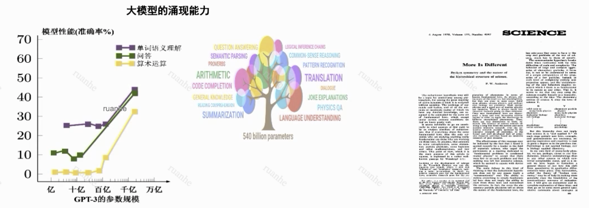

##### 推理能力

推理能力本质上是综合运用很多相关知识点，去推导出新知识或新结论。当模型规模足够大的时候，LLM 本身是具备推理能力的。在简单推理问题上，LLM 已经达到了很好的能力，但是复杂推理问题上，还需要更多深入的研究。

ChatGPT 的做法是在预训练过程中引入程序代码，和文本一起参与预训练，以此进一步增强 LLM 的推理能力。利用代码增强 LLM 推理能力，这体现出一种通过增加多样性的训练数据，来直接增强 LLM 推理能力的思路。下图给出了一份实验数据，来自于论文“On the Advance of Making  Language Models Better Reasoners”，其中 GPT-3 davinci 就是标准的 GPT-3 模型，基于纯文本训练；code-davinci-002（OpenAI 内部称为 Codex）是同时在 Code 和 NLP 数据上训练的模型。如果比较两者效果，可以看出，不论采用具体哪种推理方法，仅仅是从纯文本预训练模型切换到文本和 Code 混合预训练模型，在几乎所有测试数据集合上，模型推理能力都得到了巨大的效果提升。而其实在具体推理模型层面，我们什么也没做，仅仅是预训练的时候除了文本，额外加入了程序代码而已。

那么，一个自然的疑问是：为何预训练模型可以从代码的预训练中获得额外的推理能力？确切原因目前未知，值得深入探索。我猜测可能是因为原始版本的Codex 的代码训练是从文本生成代码，而且代码中往往包含很多文本注释，本质上这类似于预训练模型做了<文本,Code> 两种数据的多模态对齐工作。而数据中必然包含相当比例的数学或逻辑问题的代码、描述和注释，很明显这些数学类或逻辑推理类的数据对于解决下游数学推理问题是有帮助的。

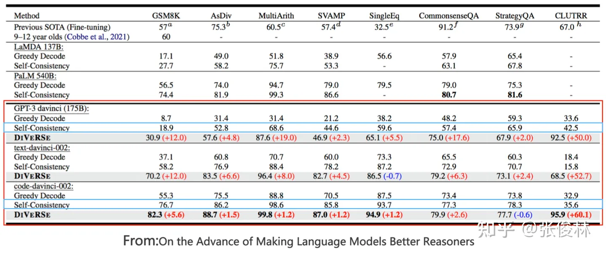

###### CoT

思维链（Chain of  Thought）是指人们在进行思考时，由于某个观点、想法或感知刺激而引发的一系列相关思维联想和关联。这些关联可以通过人们的记忆、经验、知识、情感和意识等方面来建立和加强，最终形成了一个有机的思维链，帮助人们理解和解决问题，做出决策和行动。思维链是人类思维活动的重要组成部分，它反映了人们的思考方式、思考习惯和思考效率。通过构建和加强思维链，可以帮助人们更好地理解和把握事物的本质和规律，更加有效地解决问题和做出决策。

在人工智能领域，研究人员也在探索如何利用机器学习和自然语言处理等技术，来模拟人类的思维链，建立机器的思维链，帮助机器更好地理解和处理人类的语言和行为，实现更加智能化的应用和系统。OpenAI的论文是思维链方向具有重要意义的一篇文章，在这篇文章中，他们提出了通过构建思维链提示的方式来提升模型的推理能力。思维链也是一种涌现能力，它可以通过仅提供少量的样本便大幅提升模型的逻辑推理能力。思维链的与传统提示学习的不同点是在提示中增加一个推理过程，构建一个由输入，思维链，输出构成的三元组，下图是传统提示和思维链提示的实例。

CoT 就是当模型听到一个东西之后，它会嘟嘟囔囔自说自话地，把它知道的有关这个东西的各种事情一个个说出来。比如你让模型描写一下“夏天”，它会说：“夏天是个阳光明媚的季节，人们可以去海滩游泳，可以在户外野餐……”等等。CoT 具体指一种逻辑或思考的连续性和内在关联，一个良好的 CoT 可以帮助 ChatGPT 记住之前的讨论，并在回应中保持逻辑的连贯和相关性。它维持了一个 CoT 来提供更准确、更个性化的回应，而不是仅仅基于用户的最新输入。这种能力使 ChatGPT 能够在多轮对话中提供更为有用和满意的交互体验。

CoT 的作用是让 LLM 模型明白一个道理：就是在推理过程中，步子不要迈得太大，否则很容易出错，改变思维模式，化大问题为小问题，步步为营，积小胜为大胜。

最早明确提出 CoT 这个概念的文章是“Chain of thought prompting elicits reasoning in large language  models”，论文发布于 22 年 1 月份。虽然做法很简单，但是应用 CoT 后 LLM 模型的推理能力得到了巨大提升，GSM8K 数学推理测试集准确率提高到 60.1% 左右。当然，这种给出详细推理步骤和中间过程的思想，并非 CoT 早提出的，更早一些的 [scratchpad 技术](Show Your Work: Scratchpads for Intermediate Computation with Language  Models)首先采用了类似的思路。

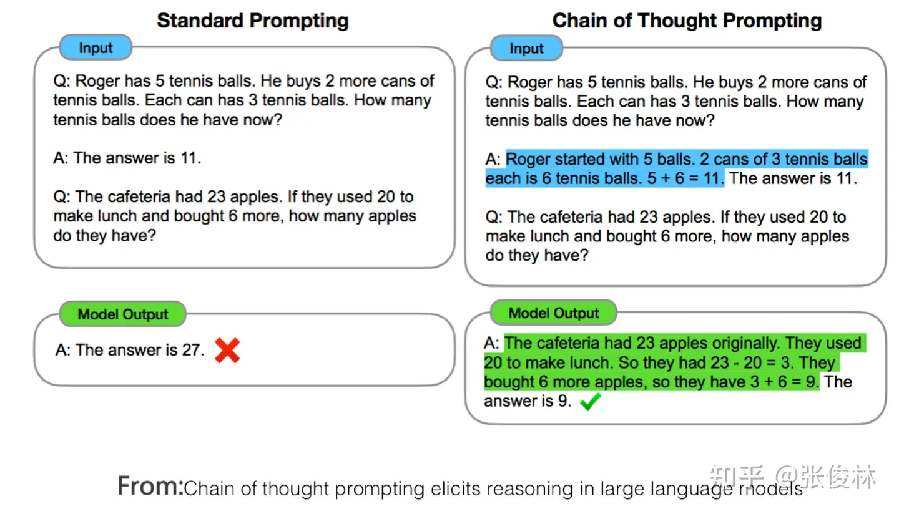

###### 效果：Few-shot

是指在只有极少量标注数据的情况下，通过利用这些数据来学习如何处理新任务。在这种学习方式中，模型可以利用少量有标注数据来学习新的任务，并推广到新的未见过的样本。例如，在图像识别中，可以使用少量的样本来训练一个模型，该模型可以识别未见过的图像。few-shot 学习通常需要有足够的泛化能力，以适应新任务的变化，并从少量标注数据中学习和推广。

##### 编程能力

CodeX 是 GPT-3 在代码生成领域的衍生版本，也是 Copilot 插件背后的基础算法。CodeX 采用了 GPT 系列的 decoder-only 架构，模型的参数量有从 12M 到 12B 等多个不同的版本。CodeX的训练分成预训练和微调两个阶段：

- 在预训练阶段，OpenAI 首先从 Github 上爬取了大量的 Python 文件，经过清洗后得到了一个大小为 159GB 的训练集。因为 CodeX 是一个代码生成模型，所以它并没有使用 GPT-3 训练好的权重，也没有完全照搬 GPT-3 的模型超参，而是重新训练了一个代码生成模型。
- 在微调阶段，OpenAI 从竞赛网站、面试网站、Github 的单元测试脚本中收集了大约 40000 条数据。在评估代码正确性上，CodeX 并没有使用传统的 BLEU 分数，而是使用了代码能够通过多少比例的单元测试作为评估标准，并建立了评估测试集 HumanEval 和评估标准 pass@k。

## 网络结构

GPT 的网络结构是基于 GPT-3 而言的，它具体包括：

- 输入层：
  - Embedding 层：它将输入的单词或符号转化为固定长度的向量表示。
  - Positional Encoding 层：由于 Transformer 结构无法自然地理解输入的顺序，位置嵌入被用来提供顺序信息。
- Block：这是 GPT-3 的核心部分，包含 1750亿 个参数，共有 96 个 block，每个 block 都包含 2 个子层：
  - MMSA：通过计算输入的自注意力分数，这一层可以捕捉输入序列中的依赖关系。
  - FF：这是一个简单的神经网络，对 MMSA 的输出进行处理。
  - Add&Norm：在每个子层的输出上进行归一化处理，以防止计算结果过大或过小。
- 输出层：将 decoder 最后一个 block 的输出转化为预测的单词或符号。

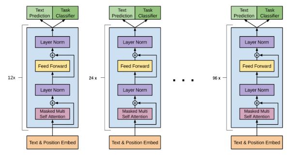

### 超参

- Vocab 词汇表大小 V：50257
- Hidden 隐藏层维度（embedding 向量维度） h：12288
- decoder 的 block 数 l：96
- Head 注意力头数为 a：96
- Seq 序列长度（每次训练输入的一个样本包含多少个 token） s：2048
- Batch 训练批次大小（每次训练包含的样本数） b：4096

### 输入层

#### Embedding

##### 参数

Embedding 矩阵的形状为 [V, h]，参数量为 `Vh` = 50257 * 12288。

#### Positional Encoding

##### 参数

关于 Positional Encoding，如果采用可训练式的位置编码，会有一些可训练模型参数，数量比较少。如果采用相对位置编码，例如 RoPE 和 ALiBi，则不包含可训练的模型参数，忽略这部分参数。

### block

因此，每个 block 的参数量为 $12h^2+13h$ 。

#### MMHA


##### 参数

MMHA 有 Query、Key、Value 的权重矩阵 $W_Q、W_K、W_V$ 和偏置 Bq、Bk、Bv ，以及输出权重矩阵 Wo 和偏置 Bo 组成。4 个权重矩阵的形状为 [h, h]，4 个偏置的形状为 [h]，MMHA 的总参数量为 $4h^2 + 4h$。

在 GPT-3 中，隐空间向量长度 h 为12288，所以 MMHA 的总参数数量是 4 * 12288 * 12288 + 4 * 12288。

#### FF


##### 参数

PFF 由 2 个线性层组成，每个线性层都有权重矩阵和偏置向量。第一个线性层是先将维度从 h 映射到 4h，第二个线性层再将维度从 4h 映射到 h。第一个线性层的权重矩阵 W1 的形状为 [h, 4h]，偏置的形状为 [4h]。第二个线性层权重矩阵 W2 的形状为 [4h, h]，偏置形状为 [h]。因此，PFF 的总参数量为 $8h^2 + 5h$。

当 h 为 12288 时，PFF 络的参数数量是 8 * 12288 * 12288 + 5 * 12288。

#### Add&Norm

MMHA 和 FF 各有一个 Add&Norm 层

##### 参数

包含了 2 个可训练模型参数：缩放参数 v 和平移参数 b ，形状都是 [h]，2 个 Add&Norm 层的参数量为 4h。


### 输出层

输出层的权重矩阵通常与 embedding 矩阵是参数共享的。

### 总计

GPT-3 有 l 个 block 的可训练模型参数量为 $l(12h^2+13h)+Vh$。当隐藏维度 h 较大时，可以忽略一次项，近似为 $12lh^2=12*96*12288^2\approx175B$。

对于 GPT-3，这个数量约为 1750 亿。

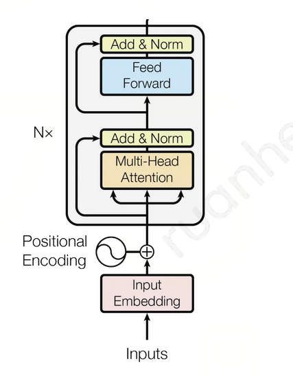

以 LLaM 参数量为例，我们有：

| 实际参数量 | 隐藏维度 | 层数 |                |
| :--------: | :------: | :--: | :------------: |
|    6.7B    |   4096   |  32  | 6,442,450,944  |
|   13.0B    |   5120   |  40  | 12,582,912,000 |
|   32.5B    |   6656   |  60  | 31,897,681,920 |
|   65.2B    |   8192   |  80  | 64,424,509,440 |


## 训练方法

### 非监督Pre-training

通过海量的数据的无监督学习来训练一个语言模型。正如之前提到过的，所谓模型即是在一个上下文中预测下一个词，这个显然是不需要带有标注的数据的，现有的任何数据集都可以作为训练数据。对于海量未标注文本，类似于文字接龙，输入 N 个、输出 N+1。这种机制可以用来回答问题，但会有多个回答，而且有些看上去不合理。

#### 数据集

有 common crawl 这只是一个网络爬取，C4 也是 common  crawl，然后还有一些高质量的数据集，例如，GitHub、维基百科、书籍、ArXiv 论文存档、StackExchange 问答网站等。这些都混合在一起，然后根据给定的比例进行采样，形成 GPT 的训练集。

#### 训练流程

##### Embedding


##### Positional


##### 前向传播

前向传播（forward pass）是在前向传播过程中，输入数据（例如图像、文本等）通过神经网络的各层进行传递，直到得到输出结果。这个过程包括了将输入数据与权重矩阵相乘、应用激活函数等操作。前向传播的目的是计算网络的预测输出，并将其与实际目标值进行比较，从而计算损失函数（loss function）的值。

##### 反向传播

反向传播（backward pass）是一种高效计算梯度的算法。在这个过程中，损失函数关于每个权重的梯度（偏导数）被计算出来。从输出层开始，沿着网络的层次结构向输入层反向传播，计算每个权重的梯度。这些梯度表示了权重对损失函数的贡献大小，因此可以用于指导权重更新。

##### 权重更新

在计算出所有权重的梯度后，我们使用优化算法（如 SGD、Adam 等）来更新权重（weight update）。这个过程中，权重会根据它们的梯度值进行调整，以减小损失函数的值。这样，模型就能逐渐学习到从输入数据中预测目标值的能力。

##### Checkpoint


### 监督Instruct Fine-tuning

第一阶段的答案可能不合理，而 Instruct Fine-tuning 阶段的目的是与输入对齐，教会模型该如何识别和执行 Instruct。在 Instruct Fine-tuning 中，模型需要处理的不再是单纯的 prompt 补全任务，而是要学习各种不同任务的“Instruct 指令”，根据 Instruct 做出相应的正确回复。通过这种 fine-tuning 方式，可以引导模型根据输入指令输出用户期望的内容。研究表明，当 Instruct 任务的种类达到一定量级后，LLM 甚至可以在一些未见过的任务上表现出较好的处理能力。

#### 数据集

预训练使用的是互联网文档，那是一种量很大但质量不高的数据，我们换成用 QA 即时响应的数据，那是低数量但高质量的“Prompt/Instruct--Response”。

首先，会在数据集中随机抽取 Instruct，由人类标注人员给出高质量答案，然后用这些人工标注好的数据来微调第一阶段的预训练模型。也就是利用标注人员标注的 SFT（Supervised Fine Tuning）数据集对预训练模型进行有监督的 Fine-tuning。通过手动编写和收集用户数据两种方式收集问题（Instruct/Prompt），然后人工编写这些问题的答案，以构建的有监督数据集来 fine-tune 预训练模型。

具体而言，OpenAI 的工程师团队设计了一个基于 Instruct 训练方式的数据集，里面有大量的 Instruct（就是问 ChatGPT 的那句话），并且详细说明了下游任务是什么。将这个训练集交给人类标注人员来记录人类的回答，并拿这个打了 label 的数据集去通过 Instruct 的方式微调 GPT-3。

##### 重要性

- Instruct 的质量
- Instruct 的多样性

#### 原理

GPT 论文给了一个不改造网络结构，只改造输入的方式来做 Fine-tuning：

- 对于分类问题，不用怎么动，加上一个起始和终结符号即可；
- 对于句子关系判断问题，比如 Entailment，两个句子中间再加个分隔符即可；
- 对文本相似性判断问题，把两个句子顺序颠倒下做出两个输入即可，这是为了告诉模型句子顺序不重要；
- 对于多项选择问题，则多路输入，每一路把文章和答案选项拼接作为输入即可。

从上图可看出，这种改造还是很方便的，不同任务只需要在输入部分施工即可。

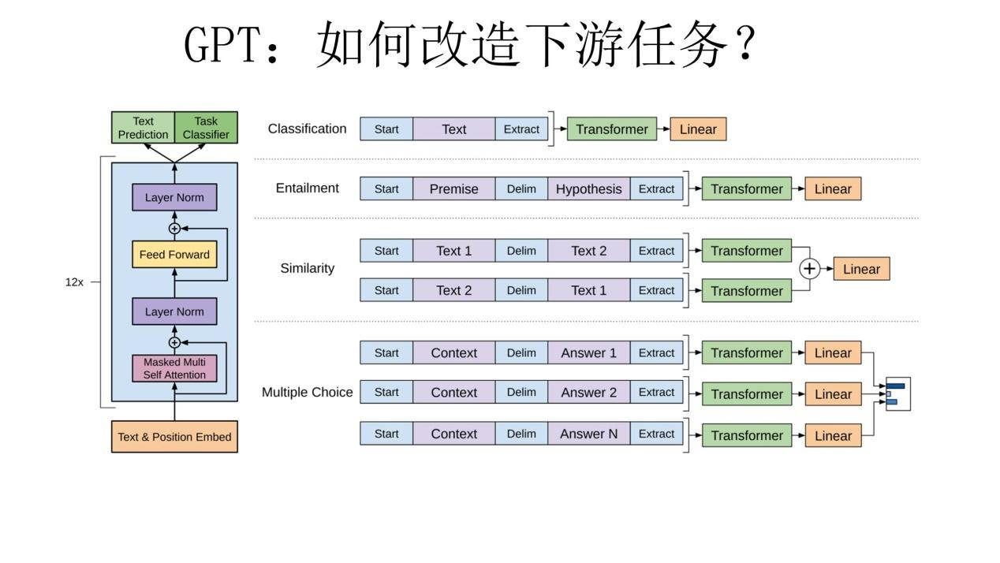

### 强化学习RLHF

有监督 Instruct Fine-tuning 后所有答案都是人类给的，可以理解为“有用的答案”。但是它能够涵盖的问题太少了（就几十万个问答），那么除了这些问题以外，其他的问题怎么办呢，就靠强化学习了。强化学习采用 RLHF（Illustrating Reinforcement Learning from Human Feedback）的机制来相对低成本的获取部分数据标注来优化 LM 的效果。ChatGPT 利用强化学习，让大模型按照人类期望的方式使用它的能力。ChatGPT 的 RF 的逻辑是先生成 Reward Model，在通过 RM 来更新 LM 模型自身。

如介绍 GPT-3 时提到的，45TB 的数据集中不能保证没出现敏感的句子，如种族歧视、辱骂等。而 LM 实际上是对训练数据集分布的拟合，这实际上直接影响了 LM 在内容生成上的质量。此外，我们不希望 LM 只受到数据的影响，希望输出结果是可控的，要保证生成的内容是有用的、真实的和无害的。所以，应该有一个机制来鼓励 LM 输出和人类偏好一致的结果，比如避免输出带有种族歧视、辱骂的语句；再比如生成的内容要有具有流畅性和语法正确性；生产的内容还需要是有用的、真实的（不能一本正经说瞎话）。

在强化学习中，智能体和环境进行交互并基于一定的奖励机制来提高自身的水平。智能体的决策，一般称为策略（policy）决定了在当前环境状态下智能体应该去实施什么动作。实施完动作后，智能体会随着环境进入下一个状态，并获得相应的奖励或惩罚。强化学习的最终目的就是要学会一个使得智能体能够最大化期望回报的 Policy，其中的回报就是对奖励进行衰减求和。

#### 原理

了解了上面的定义后我们可以停下来思考一下，强化学习学什么？ 主要想学的肯定就是策略 Policy 函数，也就是从状态到动作的一个映射。如果直接学习它，那就能够拿来使用了，这类方法也叫做基于 Policy 的方法。如果采用间接点的方式，也可以学习值函数，然后根据值的大小来选择动作，这类方法也叫做基于 value 的方法。当然，通常基于 Policy 的方法也会涉及到值函数的近似。

[RLHF](https://proceedings.neurips.cc/paper/2017/file/d5e2c0adad503c91f91df240d0cd4e49-Paper.pdf) 就是通过用人类的偏好（人工标注输出的质量分数）训练一个奖励模型（Reward Model）, 来指导 LM 的训练。[RLHF 的流程](https://huggingface.co/blog/rlhf)如下图所示：

- Initial Language Model：Pre-trianing 或 Instruct tuning 后的模型；
- Tuned Language Mode（Policy）l：Initial Lanugage Model 的副本，将在 RLHF 中更新参数，也是 RL 中的 Policy；
- Action Space：全词表，大约 50K。
- Observation Space：输入的文本序列空间。
- Reward Function：一个打分模型 Reward Model 和一个 KL 的梯度惩罚项，目的是为了使 Policy 的输出文本不要和 Initial LM 差太多，防止模型为了迎合 Reward Model 输出不连贯的文本或着胡言乱语。

RLHF 首先人工收集 LM 的输出答案，并对输入-输出对进行打分标注来训练 Reward Model。然后，在 RLHF 期间，将 Prompts 数据集中的每一个样本分别输入到 Initial LM 和 Policy 中，得到两个 output。将这 2 个 output 输入到 Reward Model 中得到评分，然后加上梯度惩罚项避免 Policy 的输出与 Initial LM 的差距太大。因此，得到 Reward Function 的输出结果。 然后根据利用 PPO 算法的 Update Rule 更新 Policy 的参数。在 InstructGPT 中，Update Rule 还包括原始 LM 的目标。

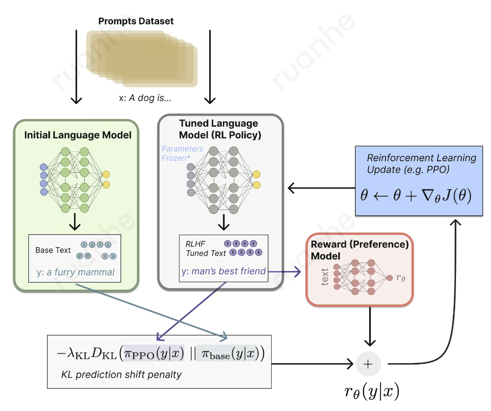

其具体分为：

- 训练奖励模型（RM）：通过构建人类反馈数据集，训练一个 Reward 模型，模仿人类偏好对结果打分，是 GPT-3 后时代 LLM 越来越像人类对话的核心技术。由于人工反馈速度慢，并且受标注人员的个人偏差影响较大，因此，OpenAI 通过训练一个 Reward 模型来拟合人类的偏好，提供一种实时的鲁棒奖励机制。该奖励模型以 prompt 和对应的回复作为输入，输出一个标量奖励值。在 Reward 模型的训练过程中，对每个prompt，随机采样 4~9 个不同的输出（回复），通过对输出文本按照质量进行人工排序，将不同回复的两两组合构成一个 Reward 模型的训练样本，通过优化每条训练样本中两个回复的奖励值之差，来训练 Reward 模型。
- 强化学习（RL）：通过 PPO 算法构造强化学习策略，对 SFT 之后的模型进一步 fine-tuning，使得模型的输出符合用户的真实意图。首先，当前模型根据输入的 prompt 输出回复。然后，Reward 模型针对回复的质量计算奖励值，并将其反馈给策略网络，用于该模型的参数更新。为防止上述过程的 PPO 算法的过度优化，需要引入词级别的 KL 惩罚项。此外，为了避免在公开 NLP 数据集上的性能退化，策略更新的过程同时引入了预训练过程的损失函数。

##### Reward Model

生成回复和 LM 的内在目标是不一致的，LM 致力于在一定上下文下预测可能性最大的下一个 token，而生成回复则是致力于生成一个人类“比较满意的答案”。因此需要训练一个奖励模型（RM），用来给 LM 输出的候选结果（同一输入有不同输出）进行打分。这一过程类似于老师的辅导，其目的是把有用的答案进一步升级成“最佳答案”。

通过人工标注出来的约 33K 训练数据来训练 RM。在数据集中随机抽取问题，使用之前生成的 LM，对于每个问题生成多个不同的答案。人类标注者对这些结果综合考虑给出排名顺序，使用这个排序结果数据来训练 RM。对多个排序结果，两两组合，形成多个训练数据对。奖励模型最终接受一个输入，给出评价回答质量的分数。这样，对于一对训练数据，调节参数使得高质量回答的打分比低质量的打分要高。

对于每一个 Prompt，用上述微调后的 LM 生成多个输出（一个 Prompt 为什么会得到多个输出，可能是用了 Beam Search）。如 A、B、C、D 四个答案，然后标注人员将 4 个答案进行排序。标注人员标注每个选项的好坏并把这个标注后的数据集用来训练 RM。再利用两两之间的排序关系训练 Reward Model 进行分数回归。其实这一步就是基于人类反馈的强化学习，即通过人类的反馈，有针对性地进行优化。**如果说深度学习是在学习表征的话，强化学习就是在学习规则。**简单来说，以前我们针对输入就只输出一个结果 A，完了不断优化结果 A；现在，我们针对输入，输出了结果 A、B、C、D，然后我还告诉模型这个 A、B、C、D 哪个好、哪个不好，模型你要好好学，尽量学出好的那些选项，而不是不好的（ Reward Model 尽量拿高分）。

##### PPO

ChatGPT 利用强化学习，让大模型按照人类期望的方式使用它的能力，其目的是利用 RM 来进一步更新 LM 模型本身（RF 中称为 Policy）。使用之前的 RM，用 PPO 算法来进一步对 LM 进行优化。PPO 的核心思路在于将 Policy Gradient 中 On-policy 的训练过程转化为 Off-policy，即将在线学习转化为离线学习，这个转化过程被称之为 Importance Sampling。这一阶段利用之前练好的 RM，靠奖励打分来更新预训练 LM 参数。在数据集中随机抽取问题，使用 PPO 模型生成回答，并用上一阶段训练好的奖励模型给出质量分数。把质量分数依次传递，由此产生策略梯度，通过强化学习的方式以更新 PPO 模型参数。

利用 Reward Model 和 PPO 算法来优化 Policy（SFT 后的模型）。也就是使用 PPO 的 Policy 来更新参数，拿预训练 LM 再预测一次数据集的结果，并通过 RM 进行打分、计算奖励（reward）。最后将这个奖励分数通过 PPO 添加到 LM/Policy 中。简而言之，就是把奖励的结果投入到 LM 的参数更新环节、不断拟合，得到最后的 LM。这里提到的 PPO（Proximal Policy Optimization）就是用来做 Policy 梯度下降。机器学习中常常举得一个栗子是，人要下山，那往哪里走，下山稳又速度快。梯度下降算法有三种类型：批量梯度下降、随机梯度下降和小批量梯度下降。PPO 算法提出了目标函数可以在多个训练步骤实现小批量的更新，解决了策略梯度算法中步长难以确定的问题。如果步长太小，训练时间就会过长。如果步长过大，有用信息会被噪音掩盖（因为每个数据影响都很大），或令性能灾难性的下降，难以收敛。

持续重复步骤二和三，RLFH 的优化过程中由于训练步子不能放得太大，即在 PPO 的 Update Rule 里加入了 KL 惩罚，因此仅仅一轮“步骤二+步骤三”可能无法达到预期。因为 SFT 后的模型输出可能符合预期的输出也不多，而通过多轮 RLHF 优化可以逐步提升输出质量。

### 训练量评估

大规模语言模型的“大”体现在两个方面：模型参数规模大，训练数据规模大。以 GPT-3 为例，GPT-3 的参数量为 1750 亿，每个参数采用 FP32（单精度浮点数）精度需要占 4B，整个模型参数就占用 700GB 的内存。进而，训练大规模语言模型面临两个主要挑战：显存效率和计算效率。

模型预训练不仅对算法、工程能力要求极高，而且对于“财力”要求也特别高，因为它通常需要很多 GPU 来支撑整个训练的过程。有人大致的算过，1750 亿参数的 GPT-3.5，训练一次的成本大约是 5000 万人民币，这还不包括前期准备和实验之类的成本。1.76 万亿参数的GPT-4，训练一次的成本大约是  5亿人民币。这样的成本，对于一般的公司、研究机构来说，基本是很难去训练自己的大模型的。

#### 显存

##### 训练

在训练过程中，占用显存的大头主要分为四部分：**模型参数、前向计算过程中产生的中间激活（网络中每一层的输出）、后向传递计算得到的梯度、优化器状态**。这里着重分析模型参数、向后梯度和优化器状态的显存占用，中间激活的显存占用后面会详细介绍。训练大模型时通常会采用 AdamW 优化器，并用混合精度训练来加速训练，基于这个前提分析显存占用。

在一次训练迭代中，每个可训练模型参数都会对应 1 个梯度，并对应 2 个优化器状态（Adam 优化器梯度的一阶动量和二阶动量）。设模型参数量为 &phi;，那么梯度的元素数量为 &phi; ，AdamW 优化器的元素数量为 2&phi;。

FP16 数据类型的参数占 2B，FP32 数据类型的参数占 4B。在混合精度训练中，会使用 FP16 的模型参数进行前向传递和后向传递，计算得到 FP16 的梯度；在优化器更新模型参数时，会使用 FP32 的优化器状态、FP 的梯度、FP32 的模型参数来更新模型参数。因此，对于每个可训练模型参数，占用了 `(2+4)+(2+4)+(4+4)=20B`。使用 AdamW 优化器和混合精度训练来训练参数量为 &phi; 的大模型，**模型参数、梯度和优化器状态占用的显存大小为 20&phi;B**。

例如 GPT-3 的 1750 亿参数在训练时需要的显存至少是 3500 GBytes。如果要提高并行度，就需要更多显存。当前比较强的 A100 显卡，单卡有 80G 显存，单卡无法进行训练，必须要多卡同时进行。因为如果显存不够的话，是根本无法开始训练的。

##### 推理

在推理阶段，没有优化器状态和梯度，也不需要保存中间激活。少了梯度、优化器状态、中间激活，推理阶段占用的显存要远小于训练阶段。模型推理阶段，占用显存的大头主要是模型参数，如果使用 FP16 来进行推理，推理阶段模型参数占用的显存大概是 2&phi;B。如果使用 KV cache 来加速推理过程，KV cache也需要占用显存。此外，输入数据也需要放到 GPU 上，还有一些中间结果（推理过程中的中间结果用完会尽快释放掉），不过这部分占用的显存是很小的，可以忽略。

#### 算力

##### 算力单位

显存容量，决定了模型能不能开始训练。 GPU 算力，决定了要训练多久。

FLOPS（Floating Point Operations per second）也被称为浮点运算能力，是一种度量计算能力的方式，表示浮点数运算次数，衡量了计算量的大小。GLOPS 是“十亿次浮点运算/秒”的简写、TLOPS 是“万亿次浮点运算/秒”的简写，主要用于描述硬件设备（如 GPU、CPU等）的计算性能。例如，某种 GPU 可能有数千个并行处理器，每个处理器可以执行一定数量的浮点运算，并且在每个时钟周期内可以执行多个操作。

浮点运算包括加法、减法、乘法和除法等操作，这些操作对于执行各种科学、工程和图形计算非常重要。下面是一个简单的计算示例：假设有一个运行在 1GHz 的 CPU，每个时钟周期可以执行 2 次浮点运算，那么它的理论峰值性能就是 2 GLOPS（20 亿次浮点运算/秒）。如果该处理器有 1000 个这样的 core，则总的浮点运算能力就是 2TLOPS。然而，实际的应用性能可能会由于各种因素（如内存带宽、缓存大小、程序优化程度等）而低于理论峰值性能。

##### 计数单位

###### 训练

我们以单位计算 unit 来计数，一次前向传播为 1 unit，一次反向传播为 2 unit（因为这里需要计算一份输出的梯度+参数的梯度），那么一次完整的训练包含了 1+2 = 3 unit，也就是对于每个 token、每个模型参数，需要 3 unit的计算。每一个 unit 的计算都是矩阵运算，我们知道对于一次矩阵运算需要进行一次乘法和一次加法共计 2 次浮点运算。综上两部分，我们可以得出对于每个 token、每个模型参数，需要进行 3 unit × 2 flops = 6 次浮点运算。 

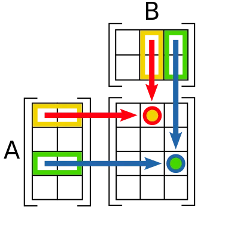

**MMHA**（待定）

在一次训练迭代中，假设输入数据的形状为 [b, s]，其中 b 为 Batch 大小，s 为 sequence 长度。MMHA 的计算公式如下：

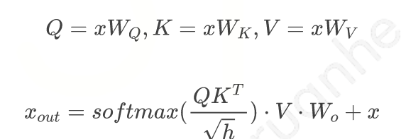

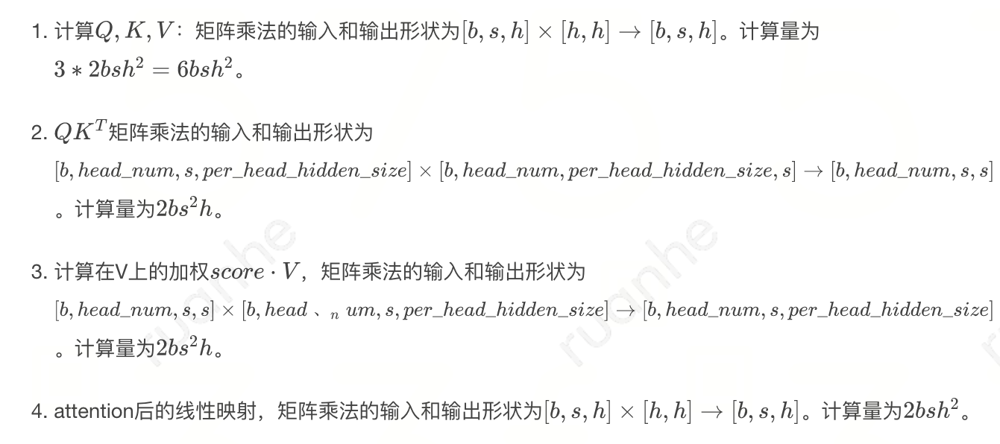

**FF（待定）**

接下来分析 FC 的计算量，计算公式如下：

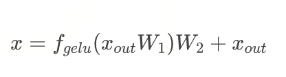

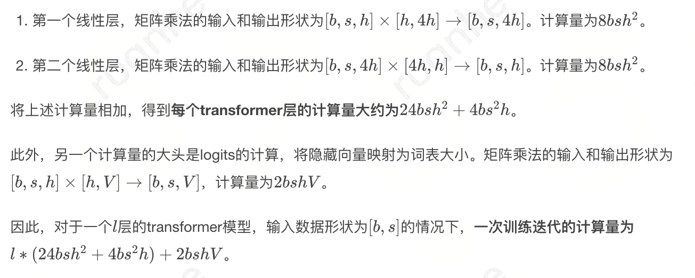

**粗略估计法（待定）**

当隐藏维度 h 比较大，且远大于序列长度 s 时，可以忽略一次项，计算量可以近似为 $24bsh^2*l$。前面提到当模型参数量为 $12lh^2$，输入的 tokens 数为 bs，存在等式 $\frac{24bsh^2*l}{12h^2*bs}=2$ 。可以近似认为：在一次前向传递中，对于每个 token-参数 需要进行 2 次浮点数运算，即一次乘法运算和一次加法运算。

**混合精度训练（待定）**

使用半精度代替全精度是一种既能减少显存占用，又能加快模型运行速度的方法。在训练小模型时，参数、梯度、优化器状态等均采用 32 位的单精度浮点数 FP32 表示，而混合精度训练的方法则通过结合 16 位半精度浮点数（参数、梯度、中间结果）和 32位单精度浮点数（优化器状态、以及参数的 FP32 副本用于参数更新）进行训练。半精度比单精度运算速度更快、占用显存更少，且已有研究表明混合精度训练的模型 loss 与全精度训练得到的 loss 是一致的，因此混合精度是训练大模型的流行方案。

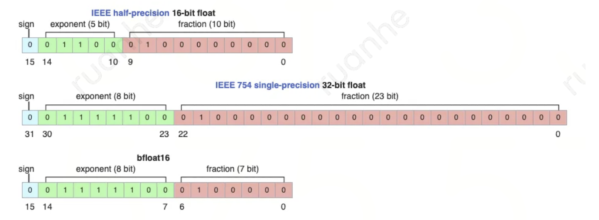

上图可以看到，FP16 的动态范围比 FP32 的动态范围要狭窄很多，因此在计算过程中很容易出现上溢出或下溢出的错误。为了避免反向传播时下溢出，我们采用 loss scaling 方法，通过放大损失值（乘以 a）来增加梯度值，并在权重更新之前，将梯度恢复为放大前的值（除以）。为了避免上溢出，我们在预训练前期使用 BF16 代替 FP16， 这是因为 BF16 的指数部分范围与 FP32 一致，上溢出风险较小。缺点是：

- 小数部分位数低于 FP16，会损失一部分精度。
- BF16 只支持 A100 机器，不支持 V100 或 CPU 运算。

###### 推理

LLM 的推理过程主要计算量在 Transformer decoder，这一层对于每个 token、每个模型参数是一个单位 unit（一次乘法、一次加法共 2 次浮点计算）的计算量。所以推理过程每个 token、每个模型参数，需要进行 1 unit × 2 flops = 2 次浮点运算。

###### 整体

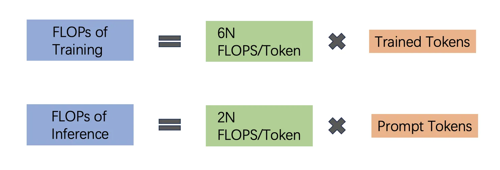

##### 算力评估

基于通用的 GPU 卡的算力信息，我们就有了可以评估所需 GPU 卡数量的依据，在上述通用算力评估的基础上，我们就有了基于 GPU 卡的算力评估：

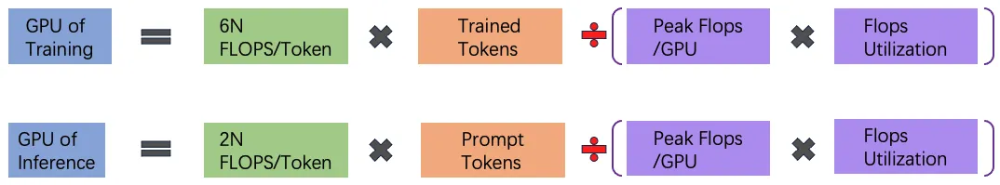

其中 FLOPS utilization 以目前业界能达到的最大值来进行推测：

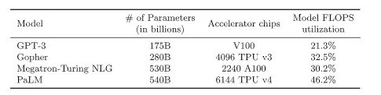

以 GPT-3 为例，其参数规模 175B、训练 token 数 300B，总计算量为 $6*174600*10^6*300*10^9=3.1428*10^{23} FLOPs$。而公开的 GPT-3 运算量 3.1e23 FLOPs，二者基本一致。

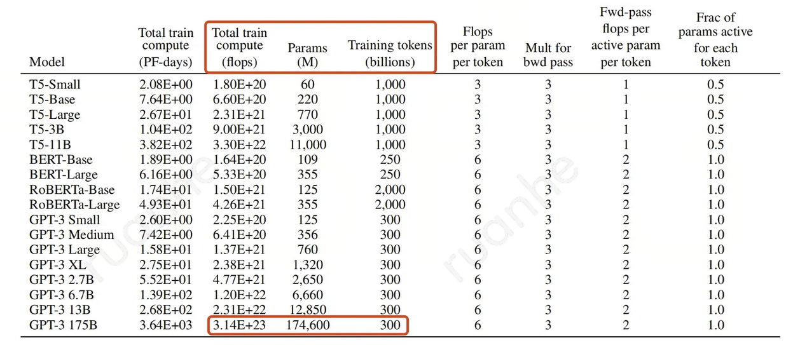

##### 训练时长

模型参数量和训练总 tokens 数决定了训练模型需要的计算量。给定硬件 GPU 类型的情况下，可以估计所需要的训练时间。

给定计算量，训练时间（也就是 GPU 算完这么多 FLOPs 的计算时间）不仅跟 GPU 类型有关，还与 GPU 利用率有关。计算端到端训练的 GPU 利用率时，不仅要考虑前向传递和后向传递的计算时间，还要考虑 GPU 加载数据、优化器更新、多卡通信和记录日志的时间。一般来讲，GPU利用率一般在 0.3-0.55 之间。

以 GPT-3 175B 为例，在 1024 张 40GB 显存的 A100 上，在 300B tokens 的数据上训练 175B 参数量。40GB 显存 A100 的峰值性能为 312T FLOPS，设 GPU 利用率为 0.46，则所需要的训练时间为 34 天。具体公式：

- 分子为训练所需要的浮点运算量：1750 亿（参数规模） × 6 × 3000 亿（token 数）
- 分母为 312 TFLOPS（一张 A100 FP16 精度下的算力） × 46.2%（利用率）× 3600 （1小时对应的秒）

得到的结果就是 **60.67万 A100/小时 = 2.53万 A100/天**。如果是 1024 张 A100，需要的训练时间约为一个月，和公开的数据也基本一致。

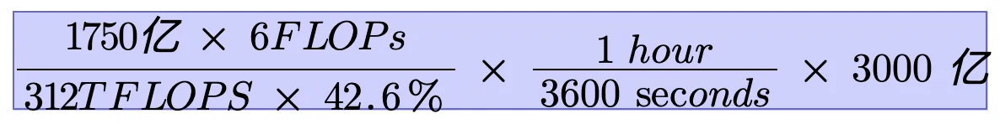

以 LLaMA-65B 为例，在 2048 张 80GB 显存的 A100 上，在 1.4TB tokens 的数据上训练了 65B 参数量的模型。80GB 显存 A100 的峰值性能为 624T FLOPS，设 GPU 利用率为 0.3，则所需要的训练时间为 21 天。


## 推理方式

### 流程

#### Tokenize分词

将输入的文本分解为更小的 token，这些部分可以是单个单词、字符等，简单理解为类似一种编码算法，把字符映射到 ID。比如下面这句 [Write a story about number 1234567.] 就可以映射到一串数字 [16594, 257, 1621, 546, 1271,  17031, 2231, 3134, 13]。

#### Embedding

Embedding 将高维度的数据（例如文字、图片、音频）映射到低维度空间的过程，最终以多维度向量表示每一个 token。

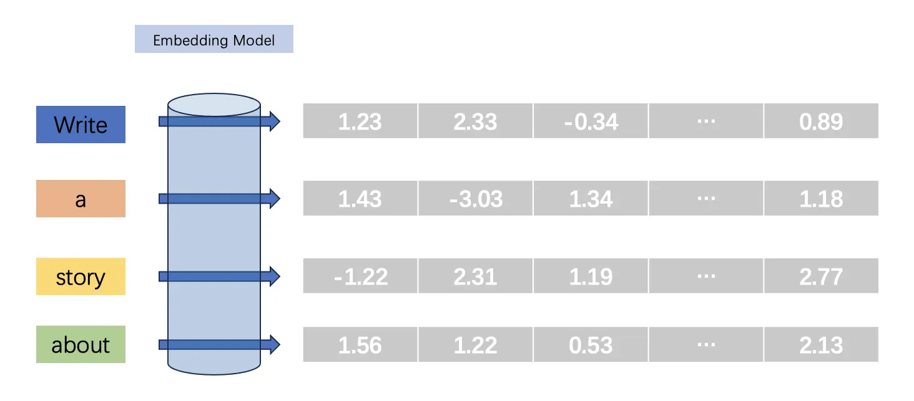

#### Positional Encoding

Positional Encoding 将 token 在句子中的位置信息进行编码，使得输入Input = Input_Embedding + Positional_Enbedding 增加位置信息。

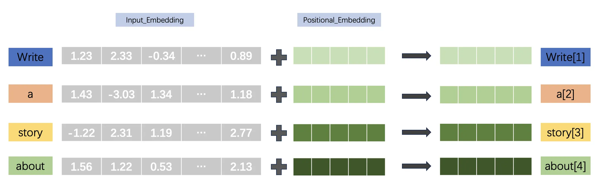

#### decoder处理

将处理后的 Input 输入神经网络 +attention 注意力模型进行处理。

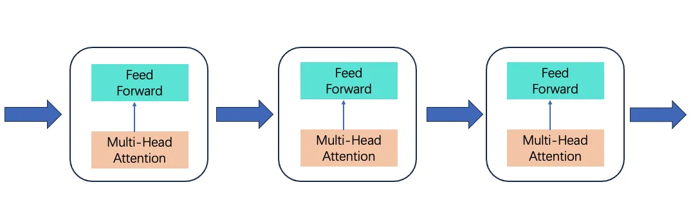

#### Softmax输出

Softmax() 将多个神经元的输出映射到（0,1）区间，进而转换为一组概率分布（加和为1）。

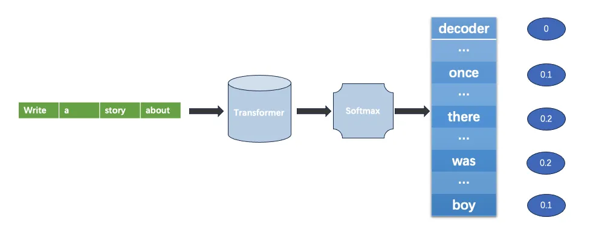

## 调用

### Role

在 ChatGPT 的交互模型中，"role" 是用来标识交互中不同参与者的角色。具体来说，有三种主要的角色：`system`、`assistant` 和 `user`。

#### system

`system` 角色代表系统本身，通常用于提供与系统相关的指令或信息，如会话开始的提示、错误消息或特定的系统指令。这些信息或指令不是由用户 user 直接输入，也不是由助手 assistant 生成，而是系统 system 预设或自动生成的信息，用于指导或通知用户和助手。

> 当一个新的对话会话开始时，系统可能会发送一条消息："Welcome to ChatGPT! How can I assist you today?" 这条消息就是由 `system` 角色生成的，用于欢迎用户并引导对话开始。

#### assistant

`assistant` 角色代表 ChatGPT 本身，即对用户输入做出回应的 AI 助手部分。当用户提出问题或发出请求时，属于 `assistant` 角色的 ChatGPT 会根据其训练和编程来生成并提供回复、信息、建议或执行特定任务。

> 用户问："What's the capital of France?"，`assistant` 回答："The capital of France is Paris." 这个回答就是由 `assistant` 角色提供的。

#### user

`user` 角色代表与 ChatGPT 交互的人类用户。用户通过输入文本来提问、发表评论或做出请求，这些输入成为对话中的 `user` 角色发出的信息。

> 如果某人输入："Can you explain how photosynthesis works?"，这个问题就是由 `user` 角色提出的，等待 `assistant` 角色回答。

#### 示例

```go
openai.ChatCompletion.create(
  model="gpt-3.5-turbo",
  messages=[
        {"role": "system", "content": "You are a helpful assistant."},
        {"role": "user", "content": "Who won the world series in 2020?"},
        {"role": "assistant", "content": "The Los Angeles Dodgers won the World Series in 2020."},
        {"role": "user", "content": "Where was it played?"}
    ]
)
```

### OpenAI API开发

- [OpenAI API开发](31_openai-api/README.md)


## Ref

1. [With SentenceTransformers ：用更低的成本给GPT做“认知升级”](https://km.woa.com/articles/show/573364)
2. [学会任务理解、真正运算和时事搜索，GPT：我将以高达形态出击！](https://km.woa.com/articles/show/573744)
3. [分析transformer模型的参数量、计算量、中间激活、KV cach](https://km.woa.com/articles/show/576309)
4. [通向AGI之路：大型语言模型（LLM）技术精要](https://zhuanlan.zhihu.com/p/597586623)
5. [人工智能领域垂直基座模型的实践和思考 -- 浙江大学 吴飞](https://sdc.qq.com/s/yHMHEg?scheme_type=netcourseOld&act_id=21590)
