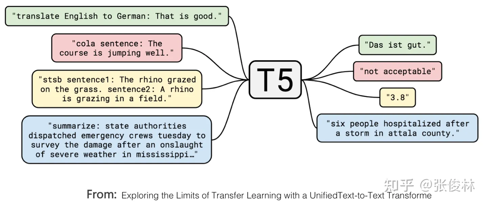
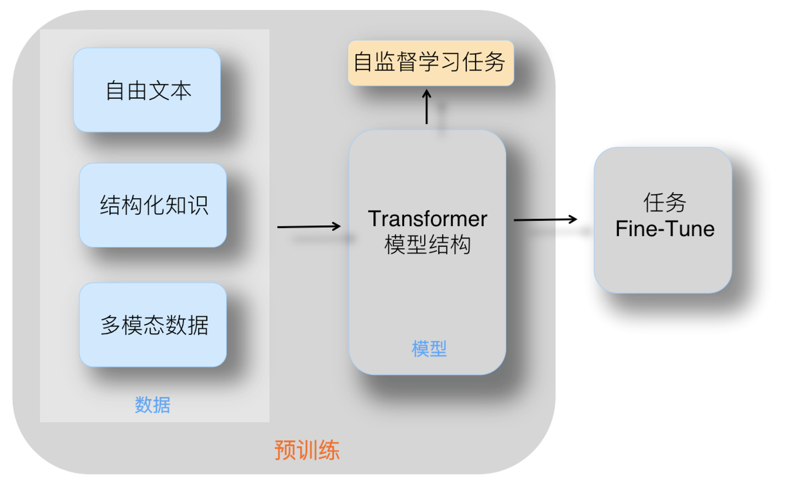
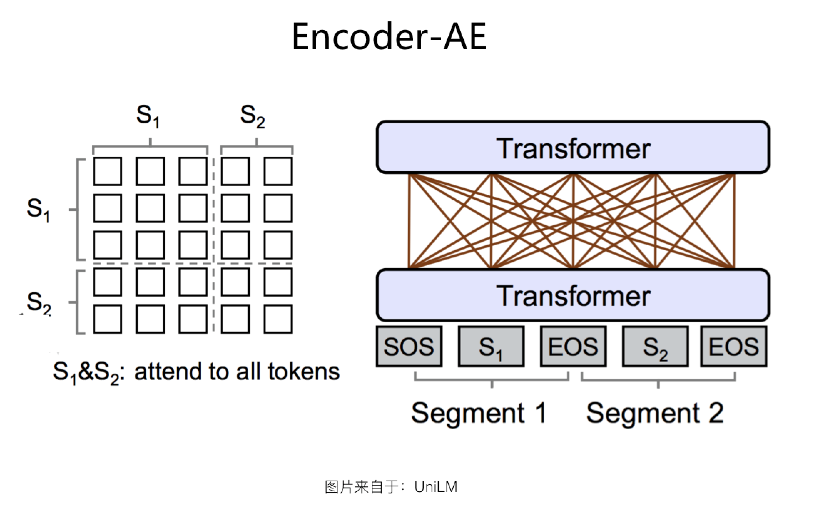
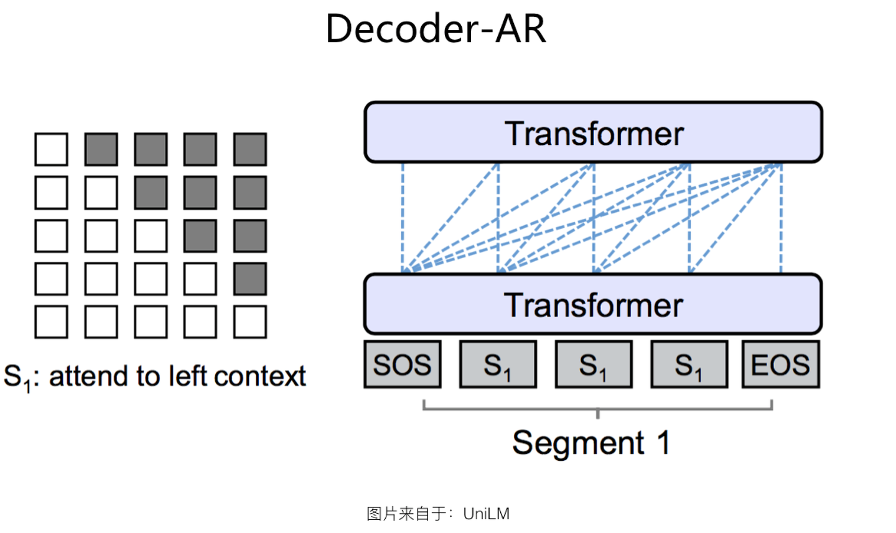
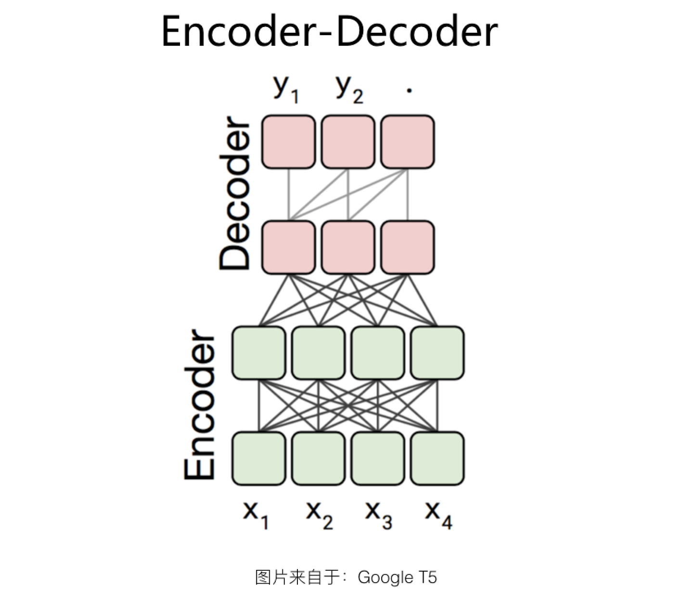
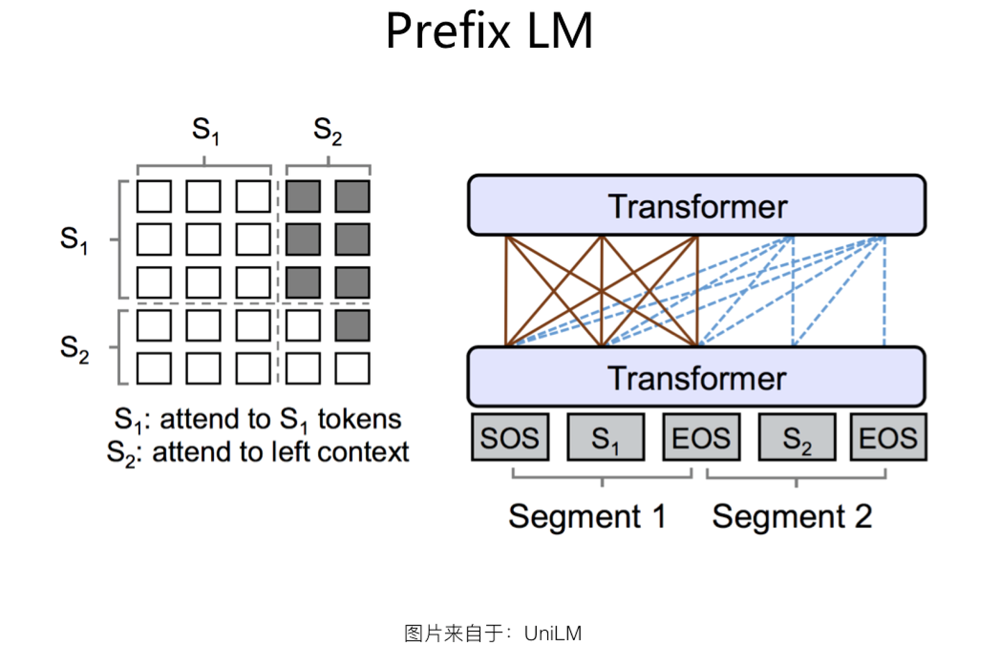
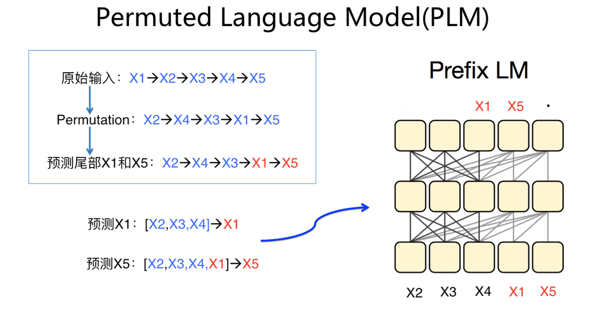
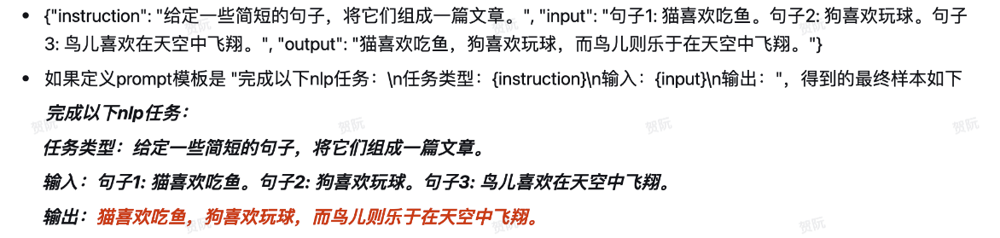

# LLM

## 简介

> 大语言模型 ∈ 深度学习 ∈ 机器学习 ∈ 人工智能

LLM 大语言模型是一种人工智能模型，旨在理解和生成人类语言。它们在大量的文本数据上进行训练，可以执行广泛的任务，包括文本总结、翻译、情感分析等等。LLM 的特点是规模庞大，包含数十亿的参数，帮助它们学习语言数据中的复杂模式。

LLM 的发展起源于 2017 年 Google 发布 Transfomer，以及 DeepMind 提出的 LMHF 的方法。LLM 是基于 Attention 机制的，最早在计算机视觉里应用的 Attention 机制被拿来用在了 NLP 里。Attention 机制的思想就是把注意力集中在重要的信息上，而忽视不重要的信息。整个网络结构是由 Attention 机制组成，并且将序列中的任意两个位置之间的距离缩小为一个常量，其次 Transformer 具有好的并行性，符合现有的 GPU 框架。

### 发展阶段

#### 第一阶段：前期探索&Embedding

2013-2017

2013 年，NLP 领域迎来了重要的突破，Embedding 技术开始崭露头角。Google 公司在 2013年 发布的 Word2vec 成为了时代的亮点，它是由 Tomas Mikolov 等人开发的。Word2vec 的工作机制是将单词映射到低维向量空间，从而捕捉单词与单词之间的语义关系。通俗地说，Word2vec 能够快速将词语转换成模型所需要的向量形式，成为 NLP 领域强有力的工具，大大提升了 NLP 的效率，同时也标志着 NLP 从基于规则转向基于数据驱动。

#### 第二阶段：BERT和自监督学习

2018-2019

在 2018 年底，Google 发布了 BERT，这是一种双向自监督预训练模型，彻底改变了 NLP 的方法。传统的自监督学习方法通常是单向的，而 BERT 则可以双向理解文本，这意味着它可以同时考虑一个词的左右上下文，大大提高了对上下文的理解。BERT 的出现引发了一波研究热潮，各种 NLP 任务的性能得到了显著提高。与此同时，OpenAI 的 GPT 模型也初露锋芒。虽然 GPT 采用了单向的自监督学习方法，但它拥有着巨大的生成能力，能够生成连贯、有逻辑的文本。这两个模型的出现使自监督学习成为 NLP 的主流方法之一。

#### 第三阶段：LMM

2020-至今

2020 年 6 月，OpenAI 发布了 GPT-3，这是一个巨大的预训练语言模型，具有数千亿的参数。GPT-3 的出现引发了广泛的讨论和关注，它展示了前所未有的生成能力。这个模型可以生成高质量的文本、回答问题、甚至创作诗歌和散文。与此同时，模型库如 Hugging Face 的 Transformer 库得到了广泛的发展和推广。这些库提供了各种预训练语言模型的实现，使研究人员和开发者能够更轻松地访问和使用这些模型，大大推动了模型的研究和应用。

为了更好地适应特定领域的需求，研究人员开始开发专用的预训练模型。例如，BioBERT 是专门用于生物医学领域的模型，LegalBERT 则专注于法律领域。专用模型使得其在相应领域的任务上表现更为出色。

这一阶段模型参数规模的持续扩大，如 GPT-4、Bard 等已经拥有千亿乃至千万亿级别的参数，这使得它们在 NLP 中的性能也越发惊人，也推动了 NLP 领域的进一步探索和创新。毋庸置疑，在模型参数规模不断扩大的同时，模型的架构也在不断演进。自回归架构成为主潮结构，这也使得其在生成式任务上表现出了更高的能力。

随着模型规模的扩大，对与人类交互的安全性和可靠性的关注也日益增加。研究人员和开发者致力于开发无毒、无偏见、不歧视的模型，以确保它们在与用户互动时不会产生有害或不当的内容。至今，这一领域的研究和工作仍在不断进行中。

总结一下，这一阶段的主要特点是模型参数规模的进一步扩大、模型架构的演变以及对与人类交互的安全性和可靠性的更多关注。

### 语言模型

语言模型（Language Model）的目的是预测该文本序列出现的联合概率。我们将文本数据映射为 token，并将这些 token 视为一系列离散的观测，例如单词或字符。假设长度为 $T$ 的文本序列中的 token 依次为 $x_1, x_2, \ldots, x_T$。于是，$x_t$（$1 \leq t \leq T$）可以被认为是文本序列在时间步 $t$ 处的观测或标签。在给定这样的文本序列时，语言模型的目标是估计序列的联合概率 $P(x_1, x_2, \ldots, x_T)$。

例如，只需要一次抽取一个词元 $x_t \sim P(x_t \mid x_{t-1}, \ldots, x_1)$​，一个理想的语言模型就能够基于模型本身生成自然文本。与猴子使用打字机完全不同的是，从这样的模型中提取的文本都将作为自然语言（如英语文本）来传递。只需要基于前面的对话片断中的文本，就足以生成一个有意义的对话。例如，短语“to recognize speech”和“to wreck a nice beach”读音上听起来非常相似。这种相似性会导致语音识别中的歧义，但是这很容易通过语言模型来解决，因为第二句的语义很奇怪。同样，在文档摘要生成算法中，“狗咬人”比“人咬狗”出现的频率要高得多，或者“我想吃奶奶”是一个相当匪夷所思的语句，而“我想吃，奶奶”则要正常得多。

#### 分类

##### 统计概率类

如n-gram

##### 神经网络类

如 Bert、GPT

#### 文档建模

假设在单词级别对文本数据进行了 token 化，我们可以依靠序列模型进行分析。让我们从基本概率规则开始 $P(x_1, x_2, \ldots, x_T) = \prod_{t=1}^T P(x_t  \mid  x_1, \ldots, x_{t-1})$。为了训练语言模型，我们需要计算 token 的概率，以及给定前面几个 token 后出现某个 token 的条件概率，这些概率本质上就是语言模型的参数。

例如，包含了 4 个单词的一个文本序列的概率是 $P(\text{deep}, \text{learning}, \text{is}, \text{fun}) =  P(\text{deep}) P(\text{learning}  \mid  \text{deep}) P(\text{is}  \mid  \text{deep}, \text{learning}) P(\text{fun}  \mid  \text{deep}, \text{learning}, \text{is})$

这里，我们假设训练数据集是一个大型的文本语料库。训练数据集中词的概率可以根据给定词的相对词频来计算。例如，可以将估计值 $\hat{P}(\text{deep})$ 计算为任何以单词 “deep” 开头的句子的概率。

一种（稍稍不太精确的）方法是统计单词“deep”在数据集中的出现次数，然后将其除以整个语料库中的单词总数。这种方法效果不错，特别是对于频繁出现的单词。接下来，我们可以尝试估计 $\hat{P}(\text{learning} \mid \text{deep}) = \frac{n(\text{deep, learning})}{n(\text{deep})}$，其中 $n(x)$ 和 $n(x, x')$ 分别是单个单词和连续单词对的出现次数。不幸的是，由于连续单词对“deep learning”的出现频率要低得多，所以估计这类单词正确的概率要困难得多。特别是对于一些不常见的单词组合，要想找到足够的出现次数来获得准确的估计可能都不容易。而对于三个或者更多的单词组合，情况会变得更糟。许多合理的三个单词组合可能是存在的，但是在数据集中却找不到。除非我们提供某种解决方案，来将这些单词组合指定为非零计数，否则将无法在语言模型中使用它们。如果数据集很小，或者单词非常罕见，那么这类单词出现一次的机会可能都找不到。

一种常见的策略是执行某种形式的拉普拉斯平滑（Laplace smoothing），具体方法是在所有计数中添加一个小常量。用 $n$ 表示训练集中的单词总数，用 $m$ 表示唯一单词的数量。此解决方案有助于处理单元素问题，例如通过：
$$
\begin{aligned}
    \hat{P}(x) & = \frac{n(x) + \epsilon_1/m}{n + \epsilon_1}, \\
    \hat{P}(x' \mid x) & = \frac{n(x, x') + \epsilon_2 \hat{P}(x')}{n(x) + \epsilon_2}, \\
    \hat{P}(x'' \mid x,x') & = \frac{n(x, x',x'') + \epsilon_3 \hat{P}(x'')}{n(x, x') + \epsilon_3}.
\end{aligned}
$$

其中，$\epsilon_1,\epsilon_2$和$\epsilon_3$是超参数。以$\epsilon_1$为例：当$\epsilon_1 = 0$时，不应用平滑；当$\epsilon_1$接近正无穷大时，$\hat{P}(x)$接近均匀概率分布$1/m$。

然而，这样的模型很容易变得无效，原因如下：首先，我们需要存储所有的计数；其次，这完全忽略了单词的意思。例如，“猫”（cat）和“猫科动物”（feline）可能出现在相关的上下文中，但是想根据上下文调整这类模型其实是相当困难的。最后，长单词序列大部分是没出现过的，因此一个模型如果只是简单地统计先前“看到”的单词序列频率，那么模型面对这种问题肯定是表现不佳的。

#### 文本表示

##### n-gram

n-gram 模型可以说是语言建模的元祖，这个概念提出于 20 世纪 20 年代，在 20 世纪 50 年代和 60 年代得到了进一步发展和形成。Claude Shannon 和 Warren Weaver 的著作《The Mathematical Theory of Communication》中也探讨了类似的思想。n-gram 模型在自然语言处理领域的早期应用主要集中在文本处理和信息检索等领域。随着计算机技术的发展，变得更加重要，并被用于各种自然语言处理任务，包括机器翻译、语音识别、文本分类和文本生成等。其核心思想是假设一个词出现的概率仅依赖于它前面的N-1个词。在预测下一个单词的概率时，只会考虑它前面的N-1个词，值得注意的是，这个“词”不单指单词，也可以是指字，比如在情感分析的时候就可以是词，在文本纠错的时候就可以是单字。以 N=1、2、3 为示例：

- Unigram（1-gram）模型：每个单词被视为独立的，其概率只取决于它自己，而不受其他单词的影响。这意味着句子的概率等于所有单词概率的乘积。
- Bigram（2-gram）模型：每个单词的概率仅取决于前一个单词。这个模型考虑了相邻单词之间的依赖关系，但没有考虑更远处的单词。
- Trigram（3-gram）模型：这个模型与bigram类似，但每个单词的概率取决于前两个单词。它更进一步考虑了单词之间的依赖关系，但仍然存在局限性。

总体来说，n-gram 是以连续的 n 个 token 的序列的形式来表示文本。它可以捕获文本中的局部语序信息，而不仅仅是单一的词汇信息。在语言模型中，n-gram 常常用于预测给定前 n-1 个 token 后的下一个 token。n-gram 模型忽略了较长范围的依赖关系，因此在处理复杂的句子结构和语言模糊性时存在限制。它们也无法处理未见过的词汇或短语，因为模型的概率是基于训练数据中出现的 n-grams 计算的。

###### 马尔可夫模型

n-gram 是基于马尔可夫模型的假设来语言建模的，如果 $P(x_{t+1} \mid x_t, \ldots, x_1) = P(x_{t+1} \mid x_t)$，则序列上的分布满足一阶马尔可夫性质。阶数越高，对应的依赖关系就越长。这种性质推导出了许多可以应用于序列建模的近似公式：
$$
\begin{aligned}
P(x_1, x_2, x_3, x_4) &=  P(x_1) P(x_2) P(x_3) P(x_4),\\
P(x_1, x_2, x_3, x_4) &=  P(x_1) P(x_2  \mid  x_1) P(x_3  \mid  x_2) P(x_4  \mid  x_3),\\
P(x_1, x_2, x_3, x_4) &=  P(x_1) P(x_2  \mid  x_1) P(x_3  \mid  x_1, x_2) P(x_4  \mid  x_2, x_3).
\end{aligned}
$$

通常，涉及一个、两个和三个变量的概率公式分别被称为一元语法（unigram）、二元语法（bigram）和三元语法（trigram）模型。

##### BoW词袋模型

BoW（Bag of Words）模型将文本表示为词汇表中每个 token 的出现频次，而不考虑它们在文本中的顺序。由于BoW为文本提供了一个固定长度的向量表示，它常用于文本分类和聚类任务。

尽管 BoW 忽略了词序信息，但它在很多应用中都表现得相当出色，特别是当与其他技术（如TF-IDF）结合使用时。

##### TF-IDF

TF-IDF（Term Frequency-Inverse Document Frequency）是一种统计方法，用于评估某个词对于一个文档集合中某个文档的重要性。它由两部分组成：词频（TF）和逆文档频率（IDF）。TF-IDF 可以为 BoW 模型中的每个 token 分配权重，出现在许多文档中的常用词（如“和”、“的”）会得到较低的权重，而仅在少数文档中出现的词则会得到较高的权重。

TF-IDF 在信息检索领域中尤为流行，用于评估查询词在文档中的重要性。TF-IDF 权重的向量可以用于计算文档之间的余弦相似性，从而用于文档推荐或查找相似文档。

#### 小批量处理

由于序列数据本质上是连续的，因此我们在处理数据时需要解决这个问题。当序列变得太长而不能被模型一次性全部处理时，我们可能希望拆分这样的序列方便模型读取。

假设我们将使用神经网络来训练语言模型，模型中的网络一次处理具有预定义长度（例如 $n$ 个时间步）的一个小批量序列。于是任意长的序列可以被我们划分为具有相同时间步数的子序列。当训练我们的神经网络时，这样的小批量子序列将被输入到模型中。假设网络一次只处理具有 $n$ 个时间步的子序列（$n=5$），并且每个时间步的词元对应于一个字符。

- 随机采样：在随机采样中，每个样本都是在原始的长序列上任意捕获的子序列。在迭代过程中，来自两个相邻的、随机的、小批量中的子序列不一定在原始序列上相邻。对于语言建模，目标是基于到目前为止我们看到的词元来预测下一个词元，因此标签是移位了一个词元的原始序列。
- 顺序分区：在迭代过程中，除了对原始序列可以随机抽样外，我们还可以保证两个相邻的小批量中的子序列在原始序列上也是相邻的。这种策略在基于小批量的迭代过程中保留了拆分的子序列的顺序，因此称为顺序分区。   

### LMM分类

#### encoder-decoder

##### T5（Google）

Google 的 T5 模型，在形式上统一了自然语言理解和自然语言生成任务的外在表现形式。如图所示，标为红色的是个文本分类问题，黄色的是判断句子相似性的回归或分类问题，这都是典型的自然语言理解问题。在 T5 模型里，这些自然语言理解问题在输入输出形式上和生成问题保持了一致，也就是说，可以把分类问题转换成让LLM模型生成对应类别的字符串，这样理解和生成任务在表现形式就实现了完全的统一。

这说明自然语言生成任务，在表现形式上可以兼容自然语言理解任务，若反过来，则很难做到这一点。这样的好处是：同一个 LLM 生成模型，可以解决几乎所有 NLP 问题。而如果仍然采取 Bert 模式，则这个 LLM 模型无法很好处理生成任务。既然这样，我们当然倾向于使用生成模型，这是一个原因。

##### BART（Facebook）

#### encoder-only

##### BERT

#### decoder-only

##### GPT

### 二阶段范式

之前深度学习在 NLP 中之所以不够成功，主要有两个方面原因于：一方面是某个具体任务有限的训练数据量。随着模型容量的增加，需要更大量的训练数据来支撑，否则很难把模型做深。另外一个方面是使用 LSTM/CNN 抽取器特征的表达能力不够强。也就是说，就算给模型再多的数据也没用，模型也不能有效地吸收数据里蕴含的知识。这两方面严重阻碍了深度学习在 NLP 领域的成功突围。

自 BERT 作为双向语言模型，他通过 Transformer 在大规模无标签语料库上使用专门设计的预练任务，使性能显著提升。BERT 的另一大贡献就是验证了“二阶段范式”（pre-train 模型预训练阶段+ fine-tuning 微调），后续科研人员将其引入如 Bart、GPT 等不同的模型中去。当前通用的 LLM 都是基于 Transformer 架构来做特征提取，并通过“二阶段范式”在大规模文本数据上进行预训练，然后微调至适用于特殊任务要求。

- 预训练阶段：模型利用大量的无标签数据（例如整个互联网的文本）来学习语言的一般模式和结构（知识），其原理是因为知识的本质是想通的。对 GPT 这种自回归语言模型来说，也就是看 LLM 是否正确预测到了下一个单词。这种学习是无监督的，因为模型不需要标签就能从数据中学习。通过在大规模的无标签数据上进行预训练，模型可以学习到单词的语义表示和上下文信息，使得模型能够生成自然流畅、准确无误的文本。其目的是一个通用的预训练模型，包含所有“世界知识”，它初步证明用语言模型压缩世界知识和自然语言知识的相通性。
- 在微调阶段：模型会在较小且更具针对性的数据集上进行进一步训练。这些数据集通常专注于某个特定任务或领域，如医学文献、法律文件或特定类型的对话数据。通过微调，模型能够更准确地理解和生成特定领域的语言，从而更有效地完成相关任务。

大多数 NLP 子领域的研发模式切换到了二阶段范式：对于自然语言理解类任务，都统一切换到了以 BERT 为代表的“双向语言模型 Pre-training+应用 Fine-tuning ”模式；而对于自然语言生成类任务，则统一切换到了以 GPT 为代表的“自回归语言模型（即从左到右单向语言模型）+Zero/Few Shot  Prompt”模式。这种范式转换带来的影响，体现在两个方面：首先，是部分 NLP 研究子领域的衰退乃至逐步消亡；其次，NLP 不同子领域的技术方法和技术框架日趋统一。

#### 预训练/Pre-training

LLM 的预训练是指在将模型用于特定任务之前，模型在大规模通用语料库上进行的初始训练阶段。具体而言，Transformer 作为特征抽取器选定合适的模型结构，通过自监督学习任务逼迫 Transformer 从大量无标注的文本中学习语言知识。这些语言知识以模型参数的方式存储在 Transformer 结构中，以供下游任务使用。

预训练的目的是让模型获得足够的通用语言理解能力，以便在后续的微调或特定任务中表现出色。模型在这个阶段会学习关于 NLP 的一般性知识，包括语法、语义、词汇等。这个过程通过自监督学习的方式进行，所以在这个过程中，语料库的规模和质量对于其获得强大的能力至关重要。一旦完成了预训练，模型可以通过微调来针对具体任务进行进一步训练，以适应特定任务的数据和要求。

而在 NLP 领域，Embedding 其实就可以看做是一种早期的预训练技术。

##### 原理

预训练的本质是通过设计好一个网络结构来做为语言模型，然后把大量无标注的语言文本利用起来。预训练任务把大量语言学知识抽取出来编码到网络结构中，当后续任务带有标注信息的数据有限时，这些先验的语言模型当然会对任务有极大的补充作用。

以图像领域的预训练为例，其网络结构一般是 CNN 的多层叠加。可以先用某个训练集，如训练集 A，对这个网络进行预先训练，在 A 任务上学会网络参数，然后存起来以备后用。假设我们面临另一个任务 B，网络结构采取相同的网络结构。在对 CNN 网络比较浅的几层进行参数初始化的时候，可以直接加载 A 任务预训练所得的网络参数，其它 CNN 高层参数仍然随机初始化。之后我们用 B 任务的训练数据来训练网络。此时有两种做法，一种是浅层加载的参数在训练 B 任务过程中不动，这种方法被称为“Frozen”；另外一种是底层网络参数尽管被初始化了，在 B 任务训练过程中仍然随着训练的进程不断改变，这种一般叫“Fine-tuning”，顾名思义，就是更好地把参数进行调整使得更适应当前的 B 任务。

预训练有几个好处。首先，如果任务 B 的训练集数据量较少，现阶段通用的 CNN（如 Resnet/Densenet/Inception 等）的网络结构层数很深，有几百万、上千万甚至上亿参数量，训练数据少很难很好地训练这么复杂的网络。但是如果其中大量参数通过大的预训练集（如 ImageNet）预先训练好直接拿来初始化大部分网络结构参数，然后再用 B 任务较少的数据进行 Fine-tuning，来调整参数让它们更适合解决 B 任务，那事情就好办多了。这样原先训练不了的任务就能解决了，即使后续任务训练数据也不少，加个预训练过程也能极大加快任务训练的收敛速度，所以这种预训练方式在做 CV 领域很快就流行开来。

预训练可行的原因在于，对于 CNN 的网络结构来说，不同层级的神经元学习到了不同类型的图像特征，由底向上特征形成层级结构。如果我们手头是个人脸识别任务，训练好网络后，把每层神经元学习到的特征可视化肉眼看一看每层学到了啥特征，你会看到最底层的神经元学到的是线段等特征，第二个隐层学到的是人脸五官的轮廓，第三层学到的是人脸的轮廓。通过三步形成了特征的层级结构，越是底层的特征越是所有不论什么领域的图像都会具备的比如边角线弧线等底层基础特征，越往上抽取出的特征越与手头任务相关。正因为此，所以预训练好的网络参数，尤其是底层的网络参数抽取出的特征跟具体任务越无关，越具备任务的通用性，所以这是为何一般用底层预训练好的参数初始化新任务网络参数的原因。而高层特征跟任务关联较大，实际可以不用使用，或采用 Fine-tuning 用新数据集合清洗掉高层无关的特征抽取器。

##### 基本流程

LLM 的预训练过程的关键步骤如下：

- 数据收集：预训练任务都是基于数据的，所以要准备好数据集。数据主要是通用文本数据，这类数据通常来源于互联网网页，它们规模较大且获取难度很低。专用文本数据则是根据任务目的去获取，比如代码或论文等科学文本。
- 数据清洗和预处理：清洗过程包括但不限于去除不必要的格式、特殊字符，确保数据的质量和一致性。而预处理数据则主要会对数据进行一下几个方面操作：1/ 过滤，删除语料库中的低质量数据——常用方法有基于分类器的方法和基于启发式的方法，但是对于第一种方法来说，经常会误删除一些有用数据，如方言、口语等，使得语料库的多样性降低。2/ 去重，在大量实验中发现，过多的重复数据也会影响语言模型的多样性，导致训练过程不稳定，从而影响模型的性能。3/ 去除隐私，在训练过程中不容小视的一步是安全性问题，因为很多数据来源于网络，所以可能包含了很多个人信息，训练前也要针对性的剔除此类数据。4/ Token 分词，这一步骤在 NLP 中已经介绍过，这里不再赘述。
- 设计 Transformer 模型架构：同普通的 NLP 任务一样，在数据准备好后，就会基于 Transformer 设计合适的模型结构，以自监督学习方法进行训练。
- 训练/调整超参：在预训练过程中，需要调整模型的超参数，如学习率、批次大小、训练轮数等，以便取得最佳的性能。
- 保存和部署预训练模型：以模型参数的方式保存预训练模型权重，以供下游任务使用。

##### Transformer架构分类

预训练模型的知识是通过 Transformer 在训练迭代中从数据集中不断学习的，并以 Transformer 模型参数的形式编码到模型中。虽然大家都是用 Transformer，但是何种模型结构的学习效率更高？所谓学习效率高，就是给定相同大小规模的训练数据，它能编码更多的知识到模型里，这就意味着它的学习效率更高。不同 Transformer 的模型结构，就会导致差异化的学习效率。

因为除了 Transformer 模型结构外，一般还包含自监督的学习方法，常见的学习方法包括 AE（AutoEncoding）和 AR（AutoRegressive）。AE 即我们常说的双向语言模型，而 AR 则代表从左到右的单向语言模型。

###### Encoder-AE

Encoder-AE 其实是包括原始版本 BERT 在内的，大多数后续改进模型采取的结构。整个结构就是一个标准的 Transformer，在语言模型预训练的时候，采用 AE 方法。也就是说，输入文本中未被 Mask 的任意单词两两可见，但是被 Mask 掉的单词之间都相互独立、互不可见。在预测某个被 Mask 掉的单词时，所有其它被 Mask 的单词都不起作用，但是句内未被 Mask 掉的所有单词，都可以参与当前单词的预测。可以看出，Encoder-AE 是个采用双向语言模型的单 Transformer 结构。

###### Decoder-AR

Decoder-AR 和 Encoder-AE 结构相同，都是采用单个的标准 Transformer，主要区别在于：语言模型预训练的时候，采用 AR 方法，就是从左到右逐个生成单词，第 i 个单词 只能看到它之前的第 1 到第 i-1 个单词，不能看到后面的单词。采用这种结构的典型模型就是 GPT 系列了。GPT-3 在文本生成任务方面的表现，确实是出乎意料地好。当然，这不能仅仅归功于这个结构本身，更为复杂的模型和更大量的数据集可能是主因。可以看出，Decoder-AR 结构是个单向语言模型的单 Transformer 结构。

从目前对比实验看，除了 Encoder-Decoder 结构外，貌似对于语言生成类的任务，这种结构是效果最好的。但对于语言理解类任务，采用这种结构的效果没有 Encoder-AE 结构好。这也好理解，因为只看到上文看不到下文，对于很多语言理解类任务而言，信息损失很大，所以效果不好也在情理之中。也就是说，这种结构比较适合做语言生成类任务。

###### Encoder-Decoder

既然 Encoder-AE 比较适合做语言理解类的任务，Decoder-AR 比较适合做语言生成类的任务。那么能否结合两者的优势，使得预训练模型既能做好生成类任务，又能做好理解类任务呢。这是个很自然的想法，而 Encoder-Decoder 结构就是如此将两者结合的。

这种结构在 Encoder 侧，单独使用一个 Transformer，采用了 Encoder-AE 的结构。也就是说，编码阶段采用双向语言模型，任意两个单词两两可见，以更充分地编码输入信息。而在 Decoder 侧，使用另外一个 Transformer，采用了 Decoder-AR 结构，从左到右逐个生成单词。当然，Decoder 侧和标准的 Decoder-AR 不同的地方还是有的：Decoder 侧生成的单词，除了像 Decoder-AR 结构一样能看到在它之前生成的单词序列外，还能看到 Encoder 侧的所有输入单词  。而这一般是通过 Decoder 侧对 Encoder 侧单词进行 Attention 操作来实现的，这种 Attention 一般放在 Encoder 顶层 Transformer Block 的输出上。

在进行预训练的时候，Encoder 和 Decoder 会同时对不同 Mask 部分进行预测：Encoder 侧双向语言模型生成被随机 Mask 掉的部分单词；而 Decoder 侧单向语言模型从左到右生成被 Mask 掉的一部分连续片断。两个任务联合训练，这样 Encoder 和 Decoder 两侧都可以得到比较充分地训练。

- T5/Prefix LM：Prefix LM 结构是 Google T5 论文中给出的叫法，这种结构最早由 UniLM 模型提出，我们沿用 Google T5 的这种称谓。如果深入分析的话，Prefix LM 其实是 Encoder-Decoder 模型的变体。在标准的 Encoder-Decoder 模型中，Encoder 和 Decoder 各自使用一个独立的 Transformer。而在 Prefix  LM 中，相当于 Encoder 和 Decoder 通过分割的方式分享了同一个 Transformer 结构，Encoder 部分占用左部，Decoder 部分占用右部，这种分割占用是通过在 Transformer 内部使用 Attention Mask 来实现的。与标准 Encoder-Decoder 类似，Prefix  LM 在 Encoder 部分采用 AE 模式，就是任意两个单词都相互可见。Decoder 部分采用 AR 模式，即待生成的单词可以见到 Encoder 侧所有单词和 Decoder 侧已经生成的单词，但是不能看未来尚未产生的单词，就是说是从左到右生成。根据的一些对比实验，在其它条件相同的情况下，关于语言理解类的任务，Prefix LM 结构的效果要弱于标准 Encoder-Decoder 结构。这里是值得深入思考下的，因为看上去 Prefix LM 和标准的 Encoder-Decoder 结构是等价的。那么，为什么它的效果比不过 Encoder-Decoder 结构呢？个人认为，一方面的原因是两者的参数规模差异导致的。另外一方面，可能与它这种模式的 Decoder 侧对 Encoder 侧的 Attention 机制有关。在 Decode r侧，Transformer 的每层  Block 对 Encoder 做 Attention 的时候，标准的 Encoder-Decoder 模式，Attention 是建立在 Encoder 侧的最后输出上，这样可以获得更全面完整的全局整合信息。而 Prefix  LM 这种结构，Decoder 侧的每层 Transformer 对 Encoder 侧的 Attention，是建立在 Encoder 的对应层上的，因为这种模式的 Encoder 和 Decoder 分割了同一个 Transformer 结构，Attention 只能在对应层内的单词之间进行，很难低层跨高层，这可能是影响这种结构效果的原因之一。Prefix LM 因为是 Encoder-Decoder 的变体，所以可以看出，它的优势也在于可以同时进行语言理解和语言生成类任务。而且相对 Encoder-Decoder 来说，因为只用了一个 Transformer，所以模型比较轻，这是 Prefix LM 的优势。缺点则是在效果方面，貌似要弱于 Encoder-Decoder 模型的效果，语言理解类任务相对有明显差距，生成类任务的效果相差不大。

- PLM：PLM（Permuted Language Model）一样采用单个 Transformer 模型作为主干结构，但是从训练方法上来说，是个很另类也很有创意的做法，是种“形为 AR，实为 AE”的做法。在语言模型预训练过程中，它看上去遵循 AR 从左到右的输入过程，这符合一般生成任务的外在表现形式。但是在内部通过 Attention Mask，实际做法其实是 AE 的做法，无非是把 AE 的做法隐藏在 Transformer 内部。它和 AE 从细节来说，主要有两个区别：首先，预训练过程中，输入句子去掉了 Mask 标记，改为内部 Attention  Mask，以保持预训练过程和下游任务 Fine-tuning 的一致性。关于这一点，目前有实验证明这个虽然有积极影响，但是影响不大。其次，也是它和 AE 的最主要区别，PLM 认为被 Mask 掉的单词之间是相互有影响的，先产生的被 Mask 掉的单词，应该对后生成的被 Mask 掉的单词在预测的时候发生作用，而标准的 AE 则认为被 Mask 掉的单词是相互独立的，相互之间不产生作用。

#### 微调/Fine-tuning

之前的预训练利用海量数据训练了一份 Transformer 模型参数保存下来，这些参数将被应用于微调。微调是在训练好的通用预训练模型的基础上，利用领域数据再做一次训练，等于把通用的预训练模型往领域方向拉动一下。“预训练+微调”的工作模式使得我们完成任务的时候，无须在从头构建一个新的模型。

与预训练不同，微调是一种监督式学习，所采用的数据带有标签。微调强调质量大于数量，不再需要一开始用到的 TB 级数据量，而是靠人工精心挑选和标注的数据来投喂。

##### 基本流程

微调是一个通用概念，不同的任务采用不同的微调方法，比如 Instruction Fine-tuning、Task-specific Fine-tuning 等，但无论选择哪种方法，其流程都大体如下：

- 选择预训练模型：根据任务选择一个在大规模数据上训练过的预训练模型。
- 准备标注数据：准备特定任务的训练数据集。这个数据集通常比预训练模型的数据集小得多，因为微调的目标是调整模型以适应新数据。
- 定义任务：为任务定义输入和输出。例如，对于文本分类，输入可以是文本，输出可以是类别标签；对于图像分割，输入可以是图像，输出可以是每个像素的标签。
- 微调模型：使用准备好的数据集，将预训练模型的权重微调，以最小化任务特定的损失函数。

##### 分类

###### Task-specific Fine-tuning

Task-specific Fine-tuning 是微调的一种具体应用，它指的是将模型微调以适应特定任务，这个任务可以是任何 NLP 类型任务，包括文本分类、文本生成、问答等。当在微调中使用特定任务的数据集和损失函数时，就可以说我们正在进行 Task-specific Fine-tuning。这通常涉及到在带标签的任务相关数据集上继续训练模型，在此过程中，模型会学到与特定任务相关的模式和信息。

例如，有一个预训练语言模型以及一个 NER（命名实体识别）任务，任务是从文本中识别出人名、地名、组织名等命名实体。以下是任务特定微调的步骤：

- 预训练模型：首先，准备一个在大规模文本数据上进行了预训练的模型，该模型具备了一定的自然语言理解能力。
- 数据准备：为了执行 NER 任务，准备一个任务特定的数据集，其中包含了包含命名实体标注的文本样本。这个数据集是特定任务的数据，通常包括训练集和验证集。
- 任务定义：定义这个任务的输入和输出格式。在 NER 任务中，输入是文本序列，输出是相应文本序列中每个词对应的命名实体标签（如人名、地名、组织名等）。
- 微调模型：使用预训练模型，将其权重微调到 NER 任务上。
- 评估和使用：一旦模型经过微调，可以在验证集上评估其性能。当性能满足要求，就可以将该模型部署到实际应用中，用于识别文本中的命名实体。

在这个例子中，Task-specific Fine-tuning 是将通用预训练模型（如 BERT）微调为特定任务 NER 的过程。通过提供任务特定的数据集和相应的标签，可以使模型学会在文本中识别命名实体。

###### Instruction Tuning

Instruction tuning 是另一种微调方式，通过提供特定领域的指令和数据来调整模型，以适应该领域的文本和任务要求。Instruction Tuning 是基于给模型提供 Instruct 来完成任务。这通常涉及给模型一个 Instruct，告诉它如何处理输入，然后用对应的输出进行微调。这种方法特别适用于多任务学习和 zero-shot 学习，其中通过 Instruction 模型可以完成多种任务，而不需要为每个任务单独微调。

例如，假设我们有一个数据集，其中每个样本是一个句子和一个简短的指示，如"Translate the following sentence to French: 'Hello world'"，其对应的输出是"Salut le monde"。通过 Instruction Tuning，模型会学习如何根据给定的指示来处理输入句子。

例如，

Instruct tuning 对于预训练模型的效果提升作用不容忽视，主要有两个方面的影响：从性能上看，此种微调方式挖掘了 LLM 的能力。在多个 LLM 上研究后发现，各种规模的都会在指令微调中受益。第二个方面则是使得任务泛化性能力大大增强，进行了指令微调的大模型，对于未曾见过的任务也能实现卓越的性能表现。

**vs. Task-specific Fine-tuning**

这两种微调方法的主要区别在于它们的应用和方式。Task-specific Fine-tuning 针对特定的任务进行微调，而 Instruction Tuning 则是基于指示来调整模型，使其能够处理多种任务。

Fine-tuning 是一个通用概念，而其他方法是 Fine-tuning 的变体或扩展，以适应不同的需求，选择适当的方法取决于任务和数据的特性。比如 Instruction Tuning 是 Fine-tuning 的一种方式，用于生成任务，依赖于任务指令。

## BERT

- [BERT](20_bert)：BERT 是代表性的的“双向语言模型预训练+Fine-tuning”模式，它采用了 Encoder-only 架构，是预训练时代的主流选择。

## ChatGPT

- [ChatGPT](30_chatgpt)：在 LLM 时代，OpenAI 笃信的 Decoder-only 结构取得了更优的效果，ChatGPT 采用了“自回归语言模型+Zero/Few Shot Prompt”模式。

## 新模型训练

### Full Fine-tuning

- [Full Fine-tuning](40_fft/README.md)

### PEFT

- [PEFT](50_peft/README.md)

### 新预训练

- [新预训练](60_new-pretrain/README.md)

## 总结

### 缺陷

#### 正确性问题

强项在于神经计算（总结经验），而不是逻辑计算（数学）

#### 缺失记忆

大语言模型在很多自然语言处理任务中取得了显著的成果，但它们在记忆方面的表现仍存在一定的局限性。这主要表现为：

- 短期记忆：大型语言模型在处理较长文本时，可能会遇到短期记忆问题。由于模型的输入序列长度有限，在处理长文本时，模型可能无法充分捕捉到文本中的全局信息。这可能导致在生成回应或进行推理时，模型无法充分考虑文本中的上下文信息，从而产生不准确或不相关的输出。
- 长期记忆：虽然大型语言模型在训练过程中会接触到大量的数据，但它们的长期记忆能力也受到限制。这是因为模型主要依赖于训练数据中的统计信息来进行预测和生成，而对于一些特定的信息（如事实、事件等），模型可能无法准确地记住并在需要时准确地调用。此外，对于模型训练过程中未接触到的新信息，模型可能无法进行有效的学习和记忆。
- 一致性问题：大型语言模型在生成文本时，可能会出现一致性问题。即使在同一个话题或问题上，模型可能会生成不一致或相互矛盾的回答。这是因为模型在生成过程中主要依赖于局部上下文信息，而缺乏对全局信息的整体把握和对话历史的长期记忆。

在大模型中，世界知识和语义理解被压缩为了静态的参数，模型不会随着交互记住我们的聊天记录和喜好，也不会调用额外的知识信息来辅助自己的判断。

#### 幻觉

大语言模型在生成文本时可能会遇到知识幻觉（knowledge hallucination）问题。在 NLP 中，幻觉通常被定义为“生成的内容与提供的源内容无意义或不可信”。这主要表现为模型在生成文本时，可能会产生一些看似合理但实际上并不准确或错误的信息。知识幻觉问题主要有以下几个原因：

- 训练数据的质量：大型语言模型在训练过程中需要大量的数据，而这些数据来源于互联网，质量参差不齐。模型可能会从训练数据中学到一些错误或不准确的信息，从而在生成过程中产生知识幻觉。
- 模型的生成策略：大型语言模型在生成文本时，通常采用基于概率的生成策略，如贪婪搜索、集束搜索或采样。这些策略可能导致模型生成一些在局部上下文看似合理，但在全局上下文或事实正确性上存在问题的文本。
- 缺乏外部知识来源：大型语言模型在生成过程中主要依赖于训练数据中的统计信息，而缺乏对外部知识库的访问。这使得模型在面对一些需要准确事实信息的任务时，可能无法生成正确的答案。
- 模型的泛化能力：虽然大型语言模型在很多任务上表现出色，但它们的泛化能力仍有待提高。在一些特定领域或具有挑战性的任务上，模型可能无法产生准确的输出，从而导致知识幻觉问题。

#### 处理复杂结构数据

对体量较大但内部结构简单的数据目前可以切片处理，但对内部结构复杂的数据（如完整的项目源代码）目前要处理还是比较麻烦。

#### 处理复杂任务

人类往往对自己给出的指令的复杂性不太敏感，有时候认为理所当然的简单要求实际上可能需要分解成复杂的步骤才能完成，分解后的步骤之间也可能存在复杂的关系。

### 今后方向

#### 多模态

随着存储容量越来越大、网络传输速度越来越快、计算速度越来越强，除了传统的文字内容外，图片、视频、音频等各种多模态数据在互联网的内容占比中越来越多。如何融合多种模态信息进行内容理解，就变得越来越重要。

传统的文本预训练本质上是让模型从海量文本中，通过语言模型来学习其中蕴含的的语言学知识。由此引发的问题是：多模态预训练也是要将某种新型的知识塞到语言模型参数中。本质上，多模态预训练要学习的知识是两种或多种模态之间的知识映射。比如对于“文字-图片”这两种多模态信息来说，我们可以把图片想像成一种特殊类型的语言，多模态预训练希望让模型学会这两种不同模态之间的语义映射，比如能够将单词“苹果”和图片中出现的苹果区域建立起联系。如果我们能够成功地学会这种不同媒介间的语义映射，那么就可以做很多有意思的事情，比如说句话就能搜出与这句话语义相近的图片。或者反过来，输入一个图片，能够找到或者生成对应的文字描述。再比如 VQA，就是给定一张图片，你可以针对图片提出一些问题，AI 系统能够回答你的问题，给出正确答案。这涉及到“图片-文字”的跨媒体问答以及一些跨媒体的知识推理。而要想实现这种能力，让模型学会两种模态之间的语义映射关系就是至关重要的。

我们面临的第一个问题是：从什么样的数据里来学习不同模态之间的语义映射关系呢？文本的预训练模型可以采纳海量无标注数据来做，然而多模态预训练要学习不同模态信息间的语义映射关系，所以需要有标注好的“模态1-模态2”的对齐数据，比如：标注好的“文本-图片”或者“文本-视频”平行数据。只有具备跨模态对齐数据，模型才有可能从中学习不同媒介类型之间的语义映射关系。从这个角度讲，相对文本预训练来说，多模态预训练因为需要模态对齐训练数据，而这种数据往往是需要人工标注的，所以可获得的数据难度及成本就高了很多，明显不如文本预训练那么自由。

总体而言，目前的多模态预训练任务中，通常都是“双模态”预训练，常见的包括“文本-图片”、“文本-视频”、“视频-音频”等模态类型组合。其中， 相对而言，“文本-图片”类型的任务技术发展比较快，其它类型的多模态类型发展相对缓慢，我猜测这里的主要原因在于可用标注数据的差异。“文本-图片”目前有一些规模达到几十万到上百万规模的标注数据集合，典型的比如 MS-COCO、Visual  Gnome 等，而其它类型的模态组合数据貌似缺乏大规模数据集合，这严重影响了领域技术进展。

#### 安全问题

## Ref

1. [乘风破浪的PTM：两年来预训练模型的技术进展](https://zhuanlan.zhihu.com/p/254821426)
